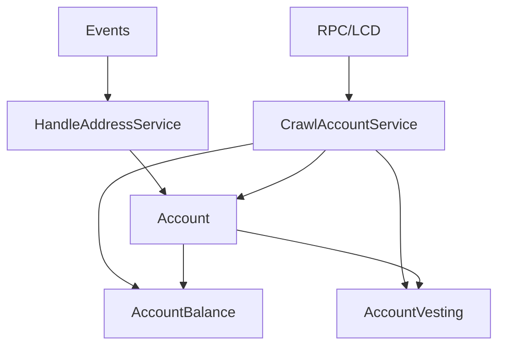
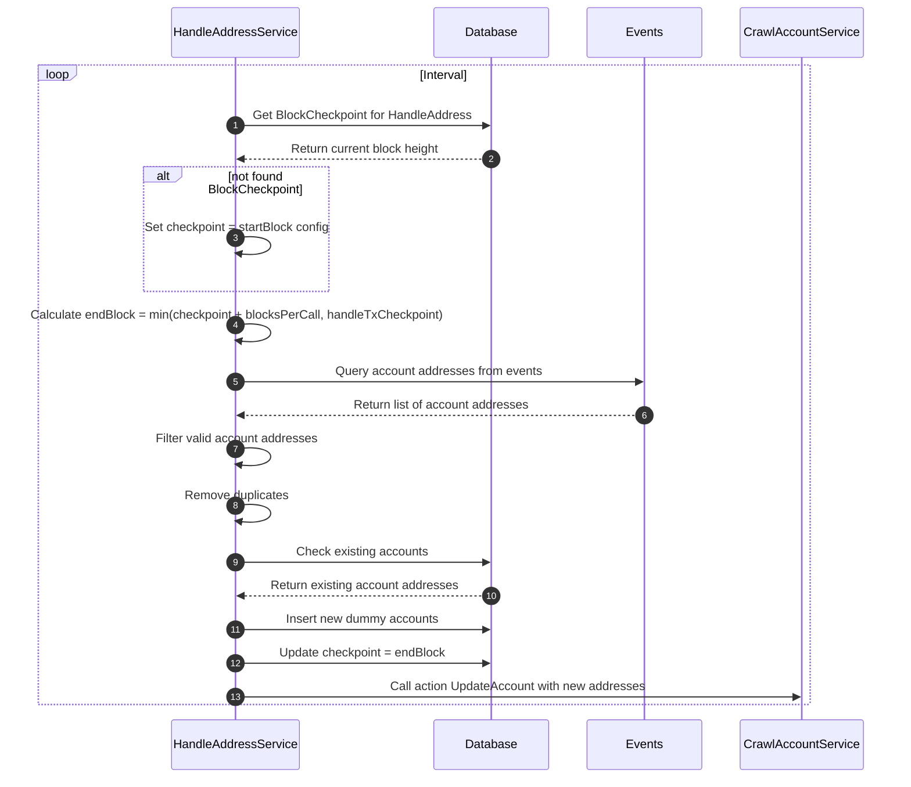
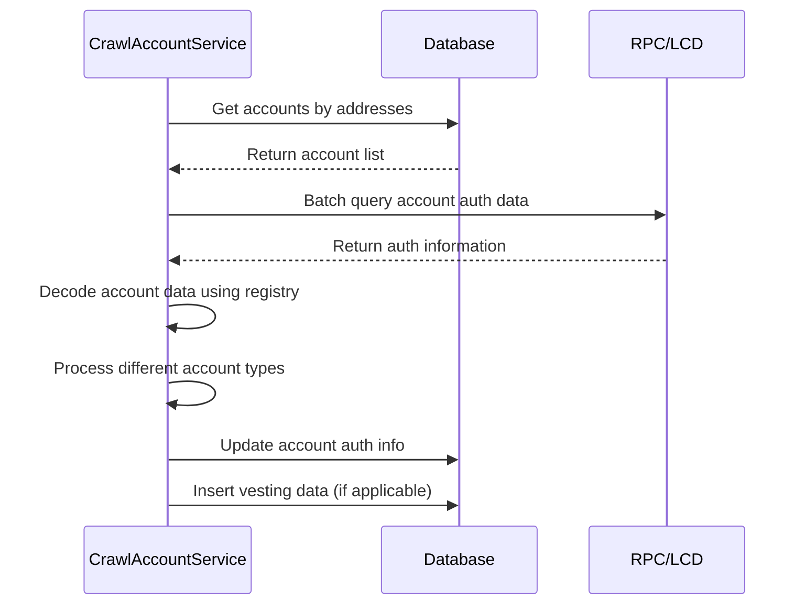
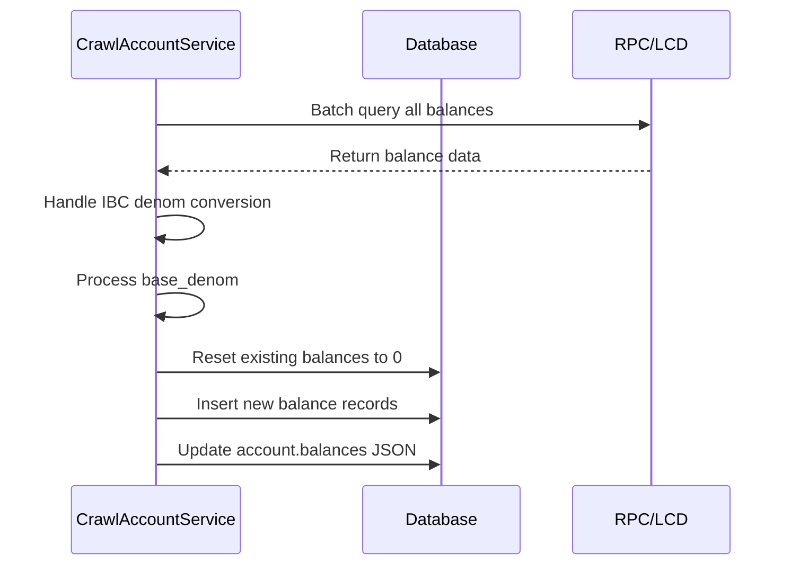

# Crawl Account Service

Dịch vụ crawl và xử lý dữ liệu tài khoản trong hệ thống indexer Cosmos modules.

## Tổng quan

Hệ thống Crawl Account bao gồm 2 service chính:

1. **HandleAddressService** - Phát hiện và tạo tài khoản mới từ events
2. **CrawlAccountService** - Cập nhật thông tin chi tiết của tài khoản từ blockchain

## Kiến trúc tổng thể



## Các Service

### 1. HandleAddressService

Service phát hiện địa chỉ tài khoản mới từ các events blockchain và tạo tài khoản cơ bản.

**Chức năng:**
- Phát hiện địa chỉ tài khoản từ events
- Tạo tài khoản mới với thông tin cơ bản
- Quản lý checkpoint để đảm bảo không bỏ sót dữ liệu
- Trigger CrawlAccountService để cập nhật thông tin chi tiết

**Quy trình xử lý:**



**Dữ liệu được xử lý:**
- Tìm kiếm địa chỉ tài khoản từ `view_event_attribute_value_index`
- Lọc địa chỉ hợp lệ theo prefix và độ dài
- Tạo tài khoản mới với thông tin cơ bản (address, evm_address)

### 2. CrawlAccountService

Service cập nhật thông tin chi tiết của tài khoản từ blockchain.

**Chức năng:**
- Cập nhật thông tin authentication (type, pubkey, account_number, sequence)
- Cập nhật balances và spendable balances
- Xử lý vesting accounts
- Hỗ trợ IBC denom conversion

**Các job chính:**

#### Account Authentication (`CRAWL_ACCOUNT_AUTH`)


#### Account Balances (`CRAWL_ACCOUNT_BALANCES`)


#### Account Spendable Balances (`CRAWL_ACCOUNT_SPENDABLE_BALANCES`)
- Tương tự như Account Balances nhưng query spendable balances
- Cập nhật `account.spendable_balances` JSON

#### Vesting Accounts (`HANDLE_VESTING_ACCOUNTS`)
- Xử lý các loại vesting accounts:
  - Continuous Vesting
  - Delayed Vesting  
  - Periodic Vesting

**Loại tài khoản được hỗ trợ:**
- Base Account
- Module Account
- Continuous Vesting Account
- Delayed Vesting Account
- Periodic Vesting Account

## Cấu trúc Database

### Bảng chính

#### account
- `id` - Primary key
- `address` - Địa chỉ tài khoản (unique)
- `evm_address` - Địa chỉ EVM tương ứng
- `balances` - JSON array chứa balances từ LCD
- `spendable_balances` - JSON array chứa spendable balances
- `type` - Loại tài khoản
- `pubkey` - Public key (JSONB)
- `account_number` - Account number
- `sequence` - Sequence number

#### account_balance
- `id` - Primary key
- `account_id` - Foreign key đến account
- `denom` - Token denomination
- `amount` - Số lượng token
- `base_denom` - Base denomination (cho IBC tokens)
- `last_updated_height` - Block height cuối cập nhật
- `type` - Loại balance (NATIVE/ERC20_TOKEN)

#### account_vesting
- `id` - Primary key
- `account_id` - Foreign key đến account (unique)
- `original_vesting` - JSON array chứa original vesting amounts
- `delegated_free` - JSON array chứa delegated free amounts
- `delegated_vesting` - JSON array chứa delegated vesting amounts
- `start_time` - Thời gian bắt đầu vesting
- `end_time` - Thời gian kết thúc vesting

## Job Queue

Các job được xử lý theo thứ tự:

1. `HANDLE_ADDRESS` - Phát hiện địa chỉ mới (chạy định kỳ)
2. `CRAWL_ACCOUNT_AUTH` - Cập nhật thông tin authentication
3. `CRAWL_ACCOUNT_BALANCES` - Cập nhật balances
4. `CRAWL_ACCOUNT_SPENDABLE_BALANCES` - Cập nhật spendable balances
5. `HANDLE_VESTING_ACCOUNTS` - Xử lý vesting accounts

## Xử lý IBC Denom

Service hỗ trợ xử lý IBC tokens:
- Chuyển đổi IBC denom thành base denom
- Lưu trữ cả IBC denom và base denom
- Hỗ trợ query theo base denom

## Cấu hình

```json
{
  "handleAddress": {
    "key": "handle_address",
    "millisecondCrawl": 5000
  },
  "crawlAccount": {
    "key": "crawl_account",
    "millisecondCrawl": 5000
  },
  "networkPrefixAddress": "aura"
}
```

## Performance Optimization

- **Batch Processing**: Sử dụng HttpBatchClient để query nhiều tài khoản cùng lúc
- **Duplicate Prevention**: Kiểm tra tài khoản đã tồn tại trước khi tạo mới
- **Efficient Queries**: Sử dụng view `view_event_attribute_value_index` để tìm địa chỉ
- **Transaction Management**: Sử dụng database transactions để đảm bảo consistency

## Error Handling

- **Retry Mechanism**: Bull queue retry cho các job thất bại
- **Logging**: Detailed logging cho debugging
- **Graceful Degradation**: Tiếp tục xử lý khi một số tài khoản lỗi
- **Checkpoint Management**: Đảm bảo không bỏ sót dữ liệu

## Monitoring

- **Block Checkpoint**: Theo dõi block height đã xử lý
- **Job Status**: Monitor trạng thái các job queue
- **Error Tracking**: Log và track các lỗi xảy ra
- **Performance Metrics**: Theo dõi thời gian xử lý và throughput

## Dependencies

- Moleculer framework
- Bull queue system
- Knex.js cho database operations
- Objection.js cho ORM
- @cosmjs/tendermint-rpc cho RPC calls
- ChainRegistry cho data decoding
- AWS S3 cho storage (nếu cần)

## API Endpoints

Các service này cung cấp dữ liệu cho các API endpoints thông qua Hasura GraphQL:

- Query accounts theo address, type, balances
- Query account balances và spendable balances
- Query vesting information
- Filter và search theo các tiêu chí khác nhau
- Aggregation queries cho thống kê

## Ví dụ sử dụng

### Query account với balances
```graphql
query GetAccountWithBalances($address: String!) {
  account(where: {address: {_eq: $address}}) {
    id
    address
    type
    balances
    spendable_balances
    account_balances {
      denom
      amount
      base_denom
    }
    account_vesting {
      original_vesting
      delegated_free
      end_time
    }
  }
}
```

### Query accounts theo balance
```graphql
query GetAccountsByBalance($denom: String!, $minAmount: String!) {
  account_balance(
    where: {
      denom: {_eq: $denom},
      amount: {_gte: $minAmount}
    }
  ) {
    account {
      address
      type
    }
    amount
  }
}
``` 