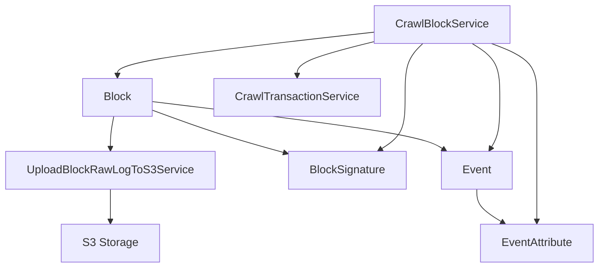
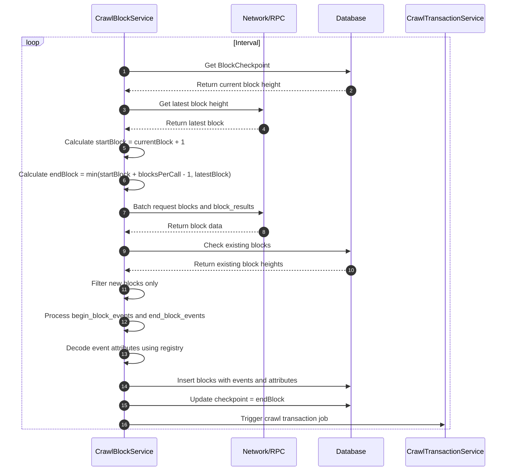
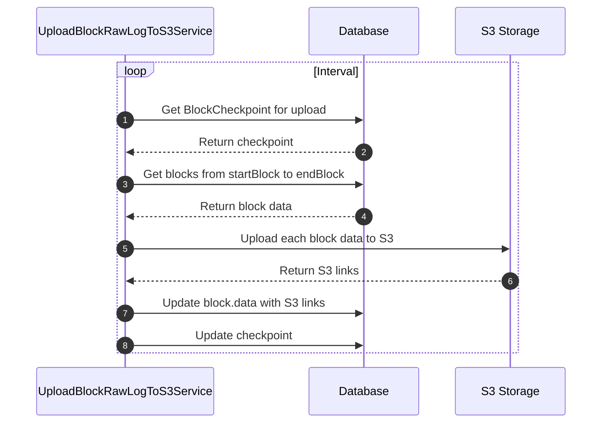

# Crawl Block Service

Dịch vụ crawl và xử lý dữ liệu block trong hệ thống indexer Cosmos modules.

## Tổng quan

Hệ thống Crawl Block bao gồm 2 service chính:

1. **CrawlBlockService** - Crawl dữ liệu block và events từ blockchain
2. **UploadBlockRawLogToS3Service** - Upload raw log của block lên S3

## Kiến trúc tổng thể



## Các Service

### 1. CrawlBlockService

Service chính để crawl dữ liệu block từ blockchain Cosmos.

**Chức năng:**
- Crawl block data từ blockchain
- Xử lý begin_block_events và end_block_events
- Lưu trữ block signatures
- Trigger crawl transaction service
- Quản lý checkpoint để đảm bảo không bỏ sót dữ liệu

**Quy trình xử lý:**



**Dữ liệu được xử lý:**

#### Block Data
- `height` - Block height
- `hash` - Block hash
- `time` - Block timestamp
- `proposer_address` - Validator proposer
- `tx_count` - Number of transactions
- `data` - Raw block data (optional)
- `signatures` - Block signatures from validators

#### Events
- **Begin Block Events**: Events emitted at the beginning of block processing
- **End Block Events**: Events emitted at the end of block processing
- **Event Attributes**: Key-value pairs associated with events

**Cấu hình:**
```json
{
  "crawlBlock": {
    "startBlock": 1,
    "blocksPerCall": 100,
    "millisecondCrawl": 5000,
    "saveRawLog": false
  }
}
```

### 2. UploadBlockRawLogToS3Service

Service upload raw log của block lên S3 storage.

**Chức năng:**
- Upload raw block data lên S3
- Cập nhật link S3 vào database
- Quản lý checkpoint riêng biệt

**Quy trình xử lý:**



**Cấu hình:**
```json
{
  "uploadBlockRawLogToS3": {
    "key": "upload_block_raw_log_to_s3",
    "millisecondCrawl": 10000,
    "overwriteS3IfFound": false,
    "returnIfFound": true
  }
}
```

## Cấu trúc Database

### Bảng chính

#### block
- `height` - Primary key, block height
- `hash` - Block hash
- `time` - Block timestamp
- `proposer_address` - Validator proposer address
- `data` - Raw block data (JSONB)
- `tx_count` - Number of transactions in block

#### event
- `id` - Primary key
- `tx_id` - Foreign key đến transaction (nullable)
- `block_height` - Foreign key đến block
- `tx_msg_index` - Message index in transaction
- `type` - Event type
- `source` - Event source (BEGIN_BLOCK_EVENT/END_BLOCK_EVENT/TX_EVENT)

#### event_attribute
- `event_id` - Foreign key đến event
- `index` - Attribute index
- `block_height` - Foreign key đến block
- `key` - Attribute key
- `value` - Attribute value
- `composite_key` - Composite key for indexing
- `tx_id` - Foreign key đến transaction (nullable)

#### block_signature
- `height` - Foreign key đến block
- `block_id_flag` - Signature flag
- `validator_address` - Validator address
- `timestamp` - Signature timestamp

## Job Queue

Các job được xử lý theo thứ tự:

1. `CRAWL_BLOCK` - Crawl block data (chạy định kỳ)
2. `UPLOAD_BLOCK_RAW_LOG_TO_S3` - Upload raw log (sau CRAWL_BLOCK)
3. `HANDLE_TRANSACTION` - Trigger từ CRAWL_BLOCK

## Xử lý Events

### Begin Block Events
- Events được emit khi bắt đầu xử lý block
- Bao gồm các events như: validator updates, evidence, etc.

### End Block Events
- Events được emit khi kết thúc xử lý block
- Bao gồm các events như: block bloom, validator set updates, etc.

### Event Attributes
- Mỗi event có thể có nhiều attributes (key-value pairs)
- Attributes được decode sử dụng ChainRegistry
- Composite key được tạo để tối ưu query: `{event_type}.{decoded_key}`

## Registry và Decoding

Service sử dụng ChainRegistry để:
- Decode event attributes
- Xử lý các loại dữ liệu khác nhau
- Hỗ trợ nhiều version của Cosmos SDK

## Monitoring và Error Handling

- **Checkpoint Management**: Đảm bảo không bỏ sót hoặc trùng lặp dữ liệu
- **Batch Processing**: Xử lý nhiều block cùng lúc để tối ưu performance
- **Error Recovery**: Retry mechanism cho các job thất bại
- **Logging**: Detailed logging cho debugging và monitoring

## Performance Optimization

- **Batch Queries**: Sử dụng HttpBatchClient để query nhiều block cùng lúc
- **Duplicate Prevention**: Kiểm tra block đã tồn tại trước khi insert
- **Indexing**: Sử dụng composite keys và indexes cho query optimization
- **Partitioning**: Event attributes được partition theo block_height

## Dependencies

- Moleculer framework
- Bull queue system
- Knex.js cho database operations
- Objection.js cho ORM
- @cosmjs/tendermint-rpc cho RPC calls
- AWS S3 cho storage
- ChainRegistry cho data decoding

## API Endpoints

Các service này cung cấp dữ liệu cho các API endpoints thông qua Hasura GraphQL:

- Query blocks theo height, hash, time range
- Query events và attributes
- Query block signatures
- Filter và search theo các tiêu chí khác nhau 