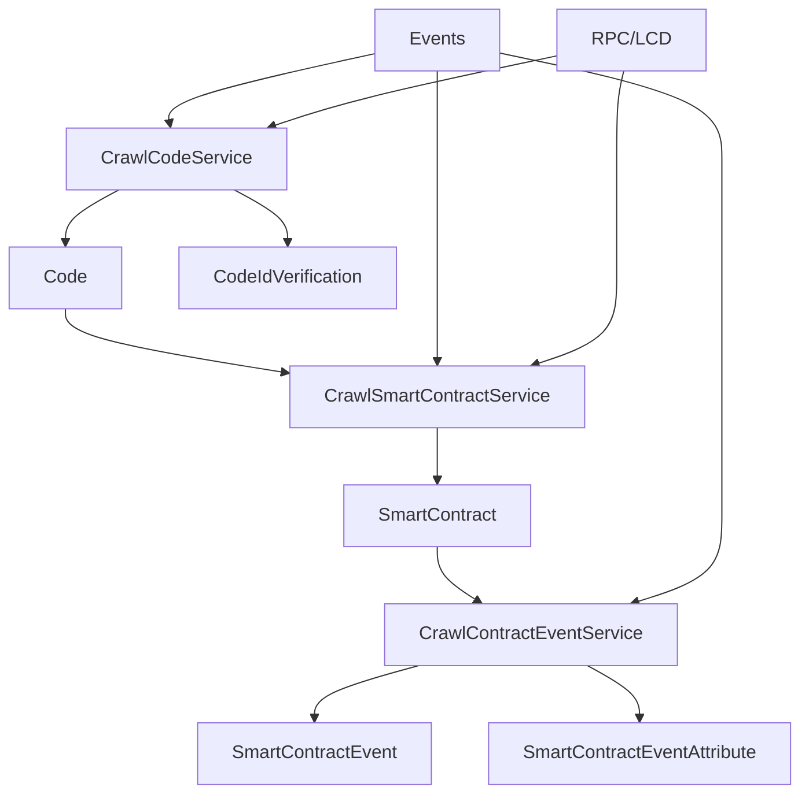
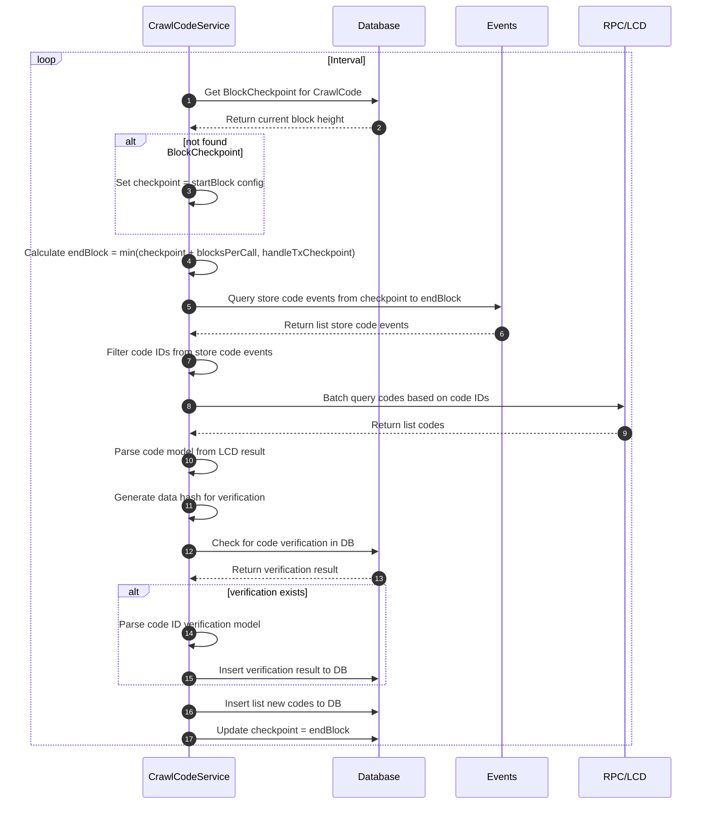
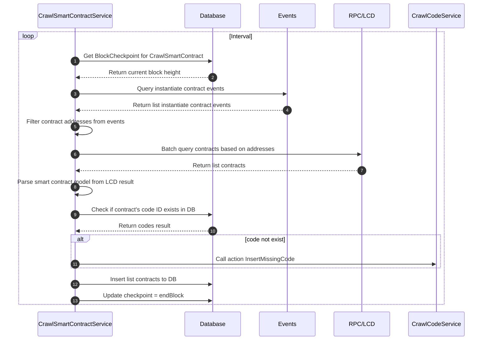
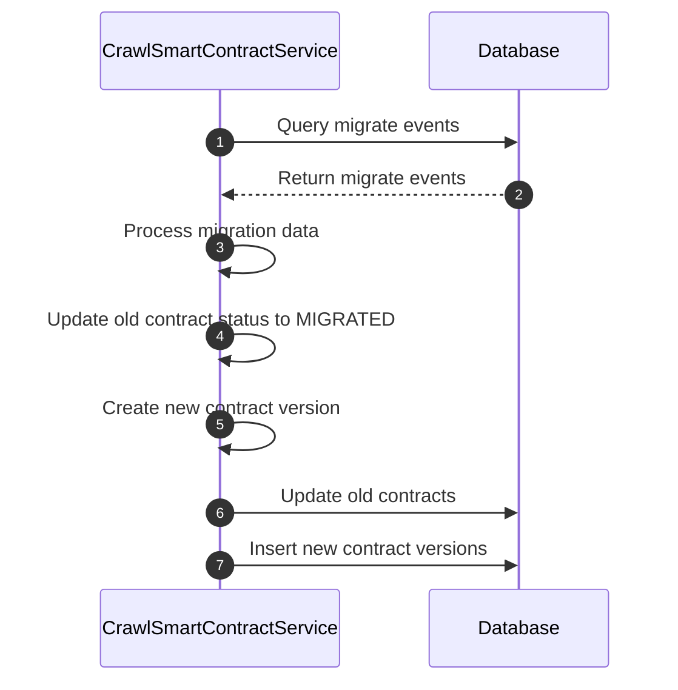
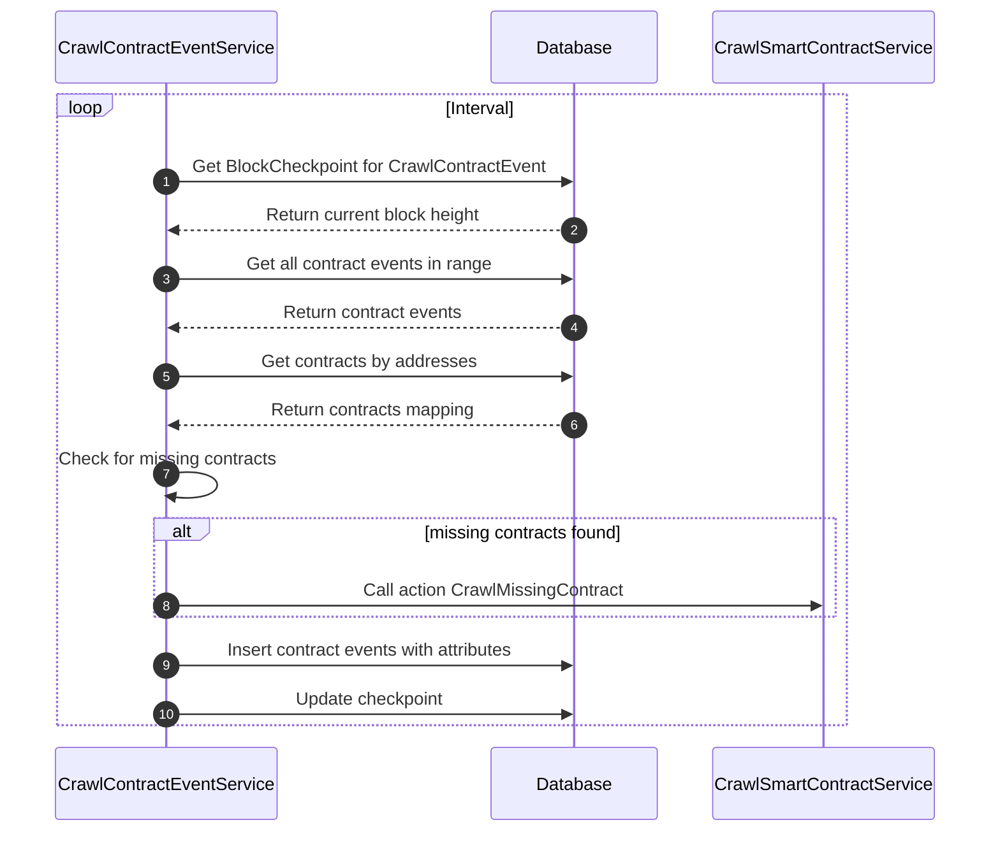

# Crawl CosmWasm Service

Dịch vụ crawl và xử lý dữ liệu CosmWasm smart contracts trong hệ thống indexer Cosmos modules.

## Tổng quan

Hệ thống Crawl CosmWasm bao gồm 3 service chính:

1. **CrawlCodeService** - Crawl dữ liệu WASM code từ blockchain
2. **CrawlSmartContractService** - Crawl dữ liệu smart contracts và xử lý migration
3. **CrawlContractEventService** - Crawl và xử lý events từ smart contracts

## Kiến trúc tổng thể



## Các Service

### 1. CrawlCodeService

Service crawl dữ liệu WASM code từ blockchain.

**Chức năng:**
- Phát hiện store code events từ transactions
- Crawl thông tin code từ blockchain
- Xử lý code verification status
- Quản lý checkpoint để đảm bảo không bỏ sót dữ liệu

**Quy trình xử lý:**



**Dữ liệu được xử lý:**
- **Store Code Events**: Events từ transactions khi upload WASM code
- **Code Information**: Thông tin code từ blockchain (creator, data_hash, instantiate_permission)
- **Code Verification**: Trạng thái verification của code

### 2. CrawlSmartContractService

Service crawl dữ liệu smart contracts và xử lý migration.

**Chức năng:**
- Phát hiện instantiate contract events
- Crawl thông tin smart contract từ blockchain
- Xử lý contract migration
- Quản lý version history của contracts

**Quy trình xử lý:**

#### Instantiate Contracts


#### Contract Migration


**Dữ liệu được xử lý:**
- **Instantiate Events**: Events khi tạo mới smart contract
- **Contract Information**: Thông tin contract từ blockchain
- **Migration Events**: Events khi contract được migrate sang code mới

### 3. CrawlContractEventService

Service crawl và xử lý events từ smart contracts.

**Chức năng:**
- Phát hiện contract events từ transactions
- Xử lý contract activities và attributes
- Đảm bảo contract tồn tại trước khi xử lý events
- Quản lý checkpoint riêng biệt

**Quy trình xử lý:**



**Dữ liệu được xử lý:**
- **Contract Events**: Events được emit từ smart contracts
- **Event Attributes**: Key-value pairs của events
- **Contract Activities**: Các hoạt động của contract (execute, query, etc.)

## Cấu trúc Database

### Bảng chính

#### code
- `id` - Primary key
- `code_id` - Code ID từ blockchain
- `creator` - Địa chỉ creator
- `data_hash` - Hash của WASM code
- `instantiate_permission` - Permission để instantiate (JSONB)
- `type` - Loại code
- `status` - Trạng thái code
- `store_hash` - Hash của transaction store code
- `store_height` - Block height khi store code

#### code_id_verification
- `id` - Primary key
- `code_id` - Foreign key đến code
- `data_hash` - Hash của WASM code
- `verification_status` - Trạng thái verification
- `verified_at` - Thời gian verification
- `verification_data` - Dữ liệu verification (JSONB)

#### smart_contract
- `id` - Primary key
- `address` - Địa chỉ contract (unique)
- `creator` - Địa chỉ creator
- `code_id` - Foreign key đến code
- `label` - Label của contract
- `name` - Tên contract
- `version` - Version của contract
- `status` - Trạng thái contract (LATEST/MIGRATED)
- `instantiate_hash` - Hash của transaction instantiate
- `instantiate_height` - Block height khi instantiate

#### smart_contract_event
- `id` - Primary key
- `smart_contract_id` - Foreign key đến smart_contract
- `action` - Action của event
- `event_id` - Foreign key đến event
- `index` - Index của event
- `tx_id` - Foreign key đến transaction

#### smart_contract_event_attribute
- `id` - Primary key
- `smart_contract_event_id` - Foreign key đến smart_contract_event
- `key` - Key của attribute
- `value` - Value của attribute

## Job Queue

Các job được xử lý theo thứ tự:

1. `CRAWL_CODE` - Crawl WASM code (sau HANDLE_TRANSACTION)
2. `CRAWL_SMART_CONTRACT` - Crawl smart contracts (sau CRAWL_CODE)
3. `HANDLE_MIGRATE_CONTRACT` - Xử lý contract migration (sau CRAWL_CODE)
4. `CRAWL_CONTRACT_EVENT` - Crawl contract events (sau CRAWL_SMART_CONTRACT)

## Xử lý Events

### Store Code Events
- Event type: `store_code`
- Attributes: `code_id`
- Xử lý: Tạo code record mới

### Instantiate Events
- Event type: `instantiate`
- Attributes: `_contract_address`, `code_id`
- Xử lý: Tạo smart contract record mới

### Migrate Events
- Event type: `migrate`
- Attributes: `_contract_address`, `code_id`
- Xử lý: Cập nhật contract với code mới

### Contract Events
- Event types: `wasm`, `execute`, `query`, etc.
- Xử lý: Lưu trữ events và attributes

## Code Verification

Service hỗ trợ code verification:
- Kiểm tra verification status dựa trên data_hash
- Tự động tạo verification record cho code đã verify
- Hỗ trợ multiple verification sources

## Contract Migration

Service xử lý contract migration:
- Theo dõi version history của contracts
- Cập nhật trạng thái contract cũ thành MIGRATED
- Tạo contract mới với version mới
- Duy trì relationship giữa các version

## Cấu hình

```json
{
  "crawlCodeId": {
    "key": "crawl_code",
    "millisecondCrawl": 5000
  },
  "crawlSmartContract": {
    "key": "crawl_smart_contract",
    "millisecondCrawl": 5000
  },
  "crawlContractEvent": {
    "key": "crawl_contract_event",
    "millisecondRepeatJob": 5000
  }
}
```

## Performance Optimization

- **Batch Processing**: Sử dụng HttpBatchClient để query nhiều items cùng lúc
- **Duplicate Prevention**: Kiểm tra records đã tồn tại trước khi insert
- **Efficient Queries**: Sử dụng joins và indexes tối ưu
- **Transaction Management**: Sử dụng database transactions để đảm bảo consistency

## Error Handling

- **Retry Mechanism**: Bull queue retry cho các job thất bại
- **Missing Code Handling**: Tự động crawl missing code khi cần
- **Missing Contract Handling**: Tự động crawl missing contracts
- **Graceful Degradation**: Tiếp tục xử lý khi một số items lỗi

## Monitoring

- **Block Checkpoint**: Theo dõi block height đã xử lý
- **Job Status**: Monitor trạng thái các job queue
- **Error Tracking**: Log và track các lỗi xảy ra
- **Performance Metrics**: Theo dõi thời gian xử lý và throughput

## Dependencies

- Moleculer framework
- Bull queue system
- Knex.js cho database operations
- Objection.js cho ORM
- @cosmjs/tendermint-rpc cho RPC calls
- ChainRegistry cho data decoding

## API Endpoints

Các service này cung cấp dữ liệu cho các API endpoints thông qua Hasura GraphQL:

- Query codes theo code_id, creator, verification status
- Query smart contracts theo address, code_id, creator
- Query contract events và activities
- Filter và search theo các tiêu chí khác nhau
- Aggregation queries cho thống kê

## Ví dụ sử dụng

### Query smart contract với events
```graphql
query GetSmartContractWithEvents($address: String!) {
  smart_contract(where: {address: {_eq: $address}}) {
    id
    address
    name
    version
    code {
      code_id
      creator
      verification_status
    }
    smart_contract_events {
      action
      event {
        type
        block_height
      }
      smart_contract_event_attributes {
        key
        value
      }
    }
  }
}
```

### Query codes theo verification status
```graphql
query GetVerifiedCodes {
  code_id_verification(
    where: {verification_status: {_eq: "SUCCESS"}}
  ) {
    code {
      code_id
      creator
      data_hash
    }
    verified_at
  }
}
``` 