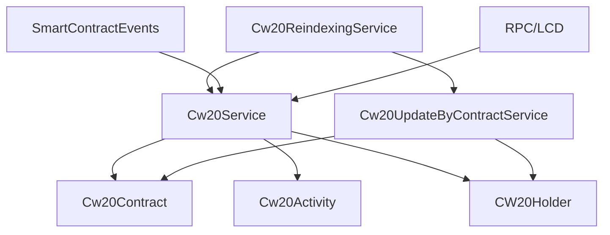
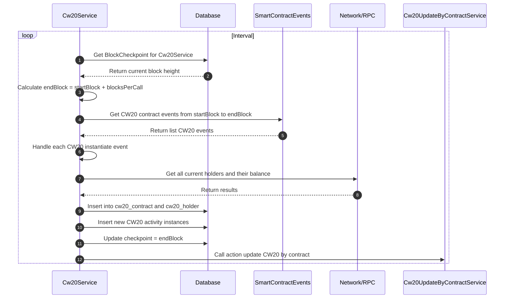
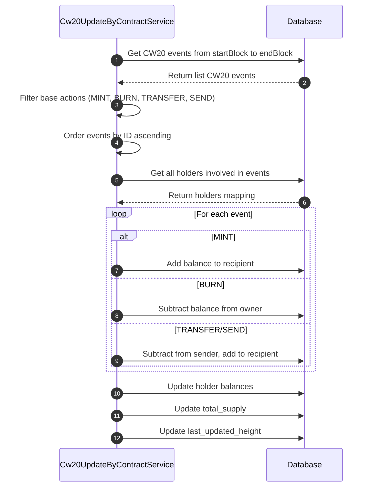
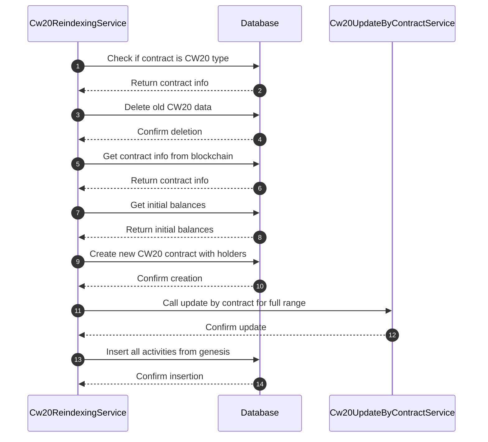

# CW20 Service

Dịch vụ crawl và xử lý dữ liệu CW20 tokens (CosmWasm fungible tokens) trong hệ thống indexer Cosmos modules.

## Tổng quan

Hệ thống CW20 bao gồm 3 service chính:

1. **Cw20Service** - Crawl dữ liệu CW20 contracts và activities
2. **Cw20UpdateByContractService** - Cập nhật balances của holders
3. **Cw20ReindexingService** - Reindex dữ liệu CW20 contracts

## Kiến trúc tổng thể



## Các Service

### 1. Cw20Service

Service chính để crawl dữ liệu CW20 contracts và activities.

**Chức năng:**
- Phát hiện CW20 instantiate events
- Crawl thông tin contract từ blockchain
- Xử lý CW20 activities (mint, burn, transfer, etc.)
- Quản lý holder balances ban đầu
- Cập nhật thống kê

**Quy trình xử lý:**



**Các actions được hỗ trợ:**
- `instantiate` - Tạo mới CW20 contract
- `mint` - Mint tokens
- `burn` - Burn tokens
- `transfer` - Transfer tokens
- `send` - Send tokens
- `transfer_from` - Transfer from (allowance)
- `burn_from` - Burn from (allowance)
- `send_from` - Send from (allowance)

### 2. Cw20UpdateByContractService

Service cập nhật balances của holders dựa trên activities.

**Chức năng:**
- Cập nhật holder balances theo events
- Tính toán total supply
- Xử lý các loại actions khác nhau
- Quản lý last_updated_height

**Quy trình xử lý:**



**Xử lý các actions:**

#### Mint
- Tăng balance của recipient
- Tăng total supply

#### Burn
- Giảm balance của owner
- Giảm total supply

#### Transfer/Send
- Giảm balance của sender
- Tăng balance của recipient
- Total supply không đổi

### 3. Cw20ReindexingService

Service reindex dữ liệu CW20 contracts.

**Chức năng:**
- Reindex toàn bộ dữ liệu của một CW20 contract
- Xóa dữ liệu cũ và tạo lại từ đầu
- Đảm bảo tính nhất quán của dữ liệu

**Quy trình xử lý:**



## Cấu trúc Database

### Bảng chính

#### cw20_contract
- `id` - Primary key
- `smart_contract_id` - Foreign key đến smart_contract (unique)
- `name` - Tên token
- `symbol` - Symbol của token
- `decimal` - Số decimal
- `total_supply` - Tổng supply
- `minter` - Địa chỉ minter
- `marketing_info` - Thông tin marketing (JSONB)
- `track` - Có theo dõi hay không
- `last_updated_height` - Block height cuối cập nhật

#### cw20_holder
- `id` - Primary key
- `cw20_contract_id` - Foreign key đến cw20_contract
- `address` - Địa chỉ holder
- `amount` - Số lượng token
- `last_updated_height` - Block height cuối cập nhật

#### cw20_activity
- `id` - Primary key
- `cw20_contract_id` - Foreign key đến cw20_contract
- `smart_contract_event_id` - Foreign key đến smart_contract_event
- `action` - Loại action (mint, burn, transfer, etc.)
- `sender` - Địa chỉ sender
- `from` - Địa chỉ from
- `to` - Địa chỉ to
- `amount` - Số lượng token
- `height` - Block height
- `tx_hash` - Transaction hash

#### cw20_total_holder_stats
- `id` - Primary key
- `cw20_contract_id` - Foreign key đến cw20_contract
- `total_holders` - Tổng số holders
- `date` - Ngày thống kê

## Job Queue

Các job được xử lý theo thứ tự:

1. `HANDLE_CW20` - Crawl CW20 contracts và activities (sau CRAWL_CONTRACT_EVENT)
2. `CW20_UPDATE_BY_CONTRACT` - Cập nhật holder balances (trigger từ HANDLE_CW20)
3. `REINDEX_CW20_CONTRACT` - Reindex contract (manual trigger)
4. `REINDEX_CW20_HISTORY` - Reindex activities (trigger từ REINDEX_CW20_CONTRACT)

## Xử lý Events

### Instantiate Events
- Event type: `instantiate`
- Xử lý: Tạo CW20 contract mới với thông tin ban đầu

### Mint Events
- Event type: `mint`
- Attributes: `amount`, `to`
- Xử lý: Tăng balance của recipient

### Burn Events
- Event type: `burn`
- Attributes: `amount`, `from`
- Xử lý: Giảm balance của owner

### Transfer Events
- Event type: `transfer`
- Attributes: `amount`, `from`, `to`
- Xử lý: Chuyển balance từ sender sang recipient

## Balance Management

Service quản lý balance theo nguyên tắc:
- **Atomic Updates**: Tất cả thay đổi balance được thực hiện trong transaction
- **Ordered Processing**: Events được xử lý theo thứ tự ID
- **Conflict Resolution**: Sử dụng `onConflict` để merge updates
- **Height Tracking**: Theo dõi `last_updated_height` để tránh duplicate

## Performance Optimization

- **Batch Processing**: Xử lý nhiều events cùng lúc
- **Efficient Queries**: Sử dụng indexes và joins tối ưu
- **Memory Management**: Sử dụng BigInt cho calculations
- **Transaction Management**: Sử dụng database transactions

## Error Handling

- **Retry Mechanism**: Bull queue retry cho các job thất bại
- **Validation**: Kiểm tra contract type trước khi xử lý
- **Graceful Degradation**: Tiếp tục xử lý khi một số events lỗi
- **Data Consistency**: Đảm bảo tính nhất quán của balance

## Monitoring

- **Block Checkpoint**: Theo dõi block height đã xử lý
- **Job Status**: Monitor trạng thái các job queue
- **Balance Tracking**: Theo dõi thay đổi balance
- **Statistics**: Cập nhật thống kê holders

## Cấu hình

```json
{
  "cw20": {
    "key": "handle_cw20",
    "millisecondCrawl": 5000
  },
  "jobRetryAttempt": 3,
  "jobRetryBackoff": 1000
}
```

## Dependencies

- Moleculer framework
- Bull queue system
- Knex.js cho database operations
- Objection.js cho ORM
- @cosmjs/tendermint-rpc cho RPC calls

## API Endpoints

Các service này cung cấp dữ liệu cho các API endpoints thông qua Hasura GraphQL:

- Query CW20 contracts theo address, symbol, name
- Query holder balances và activities
- Query transfer history
- Filter và search theo các tiêu chí khác nhau
- Aggregation queries cho thống kê

## Ví dụ sử dụng

### Query CW20 contract với holders
```graphql
query GetCw20ContractWithHolders($address: String!) {
  cw20_contract(
    where: {smart_contract: {address: {_eq: $address}}}
  ) {
    id
    name
    symbol
    total_supply
    decimal
    cw20_holders {
      address
      amount
      last_updated_height
    }
    cw20_activities {
      action
      amount
      from
      to
      height
      tx_hash
    }
  }
}
```

### Query holder balance history
```graphql
query GetHolderBalanceHistory($contractId: Int!, $address: String!) {
  cw20_activity(
    where: {
      cw20_contract_id: {_eq: $contractId},
      _or: [{from: {_eq: $address}}, {to: {_eq: $address}}]
    },
    order_by: {height: asc}
  ) {
    action
    amount
    from
    to
    height
    tx_hash
  }
}
```

### Query top holders
```graphql
query GetTopHolders($contractId: Int!, $limit: Int!) {
  cw20_holder(
    where: {cw20_contract_id: {_eq: $contractId}},
    order_by: {amount: desc},
    limit: $limit
  ) {
    address
    amount
    last_updated_height
  }
}
``` 