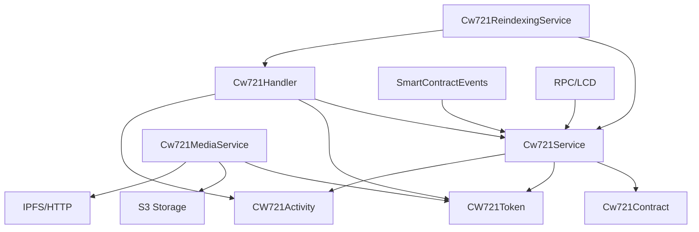
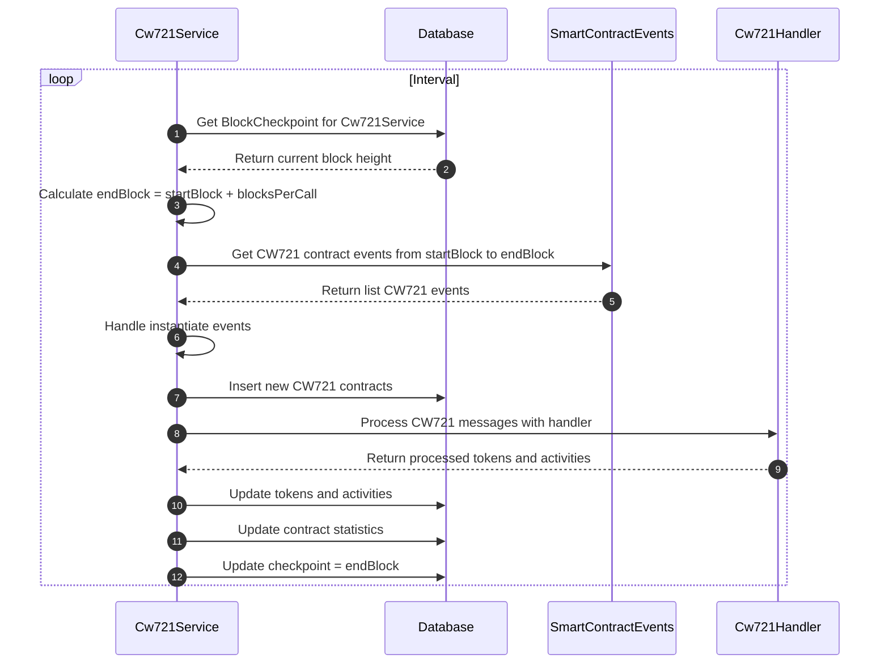
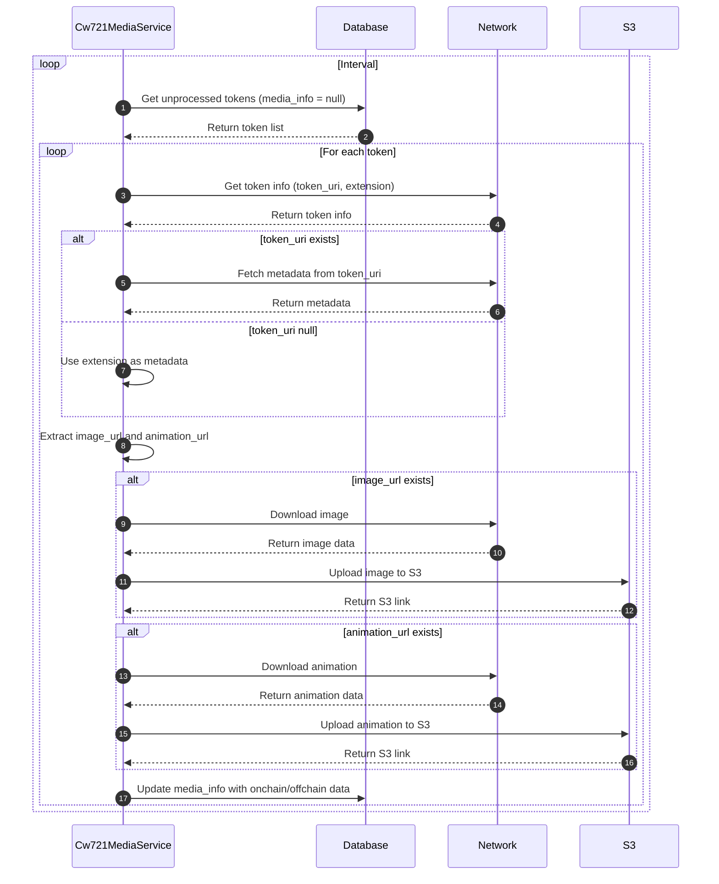
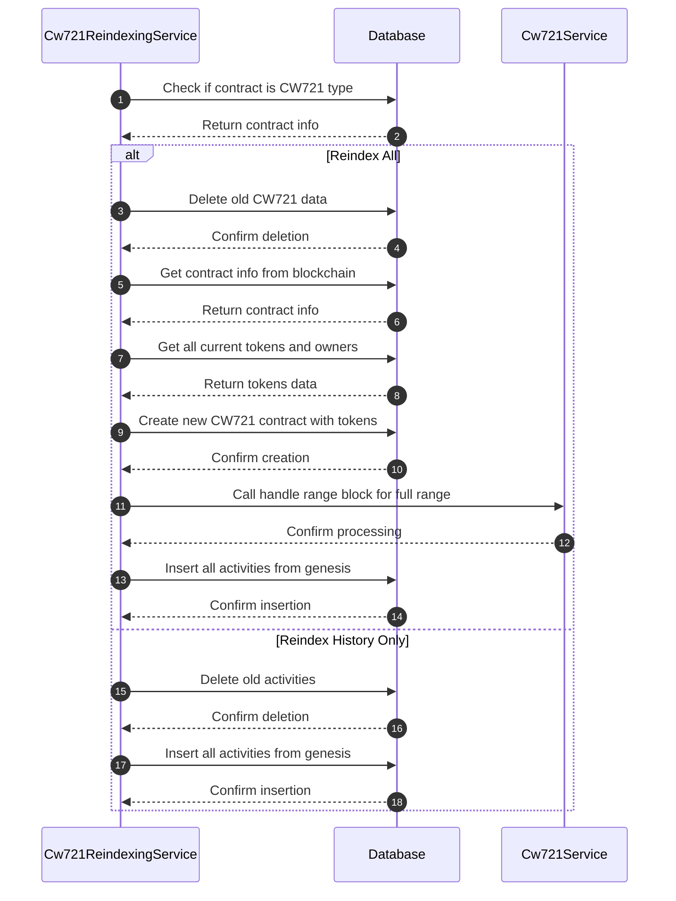

# CW721 Service

Dịch vụ crawl và xử lý dữ liệu CW721 tokens (CosmWasm non-fungible tokens) trong hệ thống indexer Cosmos modules.

## Tổng quan

Hệ thống CW721 bao gồm 4 service chính:

1. **Cw721Service** - Crawl dữ liệu CW721 contracts và activities
2. **Cw721Handler** - Xử lý logic cho các loại actions khác nhau
3. **Cw721MediaService** - Xử lý metadata và media của tokens
4. **Cw721ReindexingService** - Reindex dữ liệu CW721 contracts

## Kiến trúc tổng thể



## Các Service

### 1. Cw721Service

Service chính để crawl dữ liệu CW721 contracts và activities.

**Chức năng:**
- Phát hiện CW721 instantiate events
- Crawl thông tin contract từ blockchain
- Xử lý CW721 activities (mint, burn, transfer, etc.)
- Quản lý token ownership và metadata
- Cập nhật thống kê

**Quy trình xử lý:**



**Các actions được hỗ trợ:**
- `instantiate` - Tạo mới CW721 contract
- `mint` - Mint NFT tokens
- `burn` - Burn NFT tokens
- `transfer_nft` - Transfer NFT tokens
- `send_nft` - Send NFT tokens

### 2. Cw721Handler

Handler xử lý logic cho các loại actions khác nhau.

**Chức năng:**
- Xử lý mint events - Tạo token mới
- Xử lý transfer events - Cập nhật ownership
- Xử lý burn events - Đánh dấu token bị burn
- Quản lý token state và activities

**Xử lý các actions:**

#### Mint
- Tạo token mới với owner
- Tăng total supply của contract
- Tạo activity record

#### Transfer/Send
- Cập nhật owner của token
- Tạo activity record với from/to
- Cập nhật last_updated_height

#### Burn
- Đánh dấu token bị burn
- Giảm total supply của contract
- Tạo activity record

### 3. Cw721MediaService

Service xử lý metadata và media của tokens.

**Chức năng:**
- Crawl metadata từ token_uri
- Download và upload media lên S3
- Xử lý IPFS và HTTP links
- Quản lý media_info structure

**Quy trình xử lý:**



**Media Info Structure:**
```json
{
  "onchain": {
    "token_uri": "ipfs://...",
    "extension": {...},
    "metadata": {
      "image": "ipfs://...",
      "animation_url": "ipfs://..."
    }
  },
  "offchain": {
    "image": {
      "url": "https://s3...",
      "content_type": "image/png",
      "file_path": "path/to/image"
    },
    "animation": {
      "url": "https://s3...",
      "content_type": "video/mp4",
      "file_path": "path/to/animation"
    }
  }
}
```

### 4. Cw721ReindexingService

Service reindex dữ liệu CW721 contracts.

**Chức năng:**
- Reindex toàn bộ dữ liệu của một CW721 contract
- Reindex chỉ history của contract
- Xóa dữ liệu cũ và tạo lại từ đầu
- Đảm bảo tính nhất quán của dữ liệu

**Quy trình xử lý:**



## Cấu trúc Database

### Bảng chính

#### cw721_contract
- `id` - Primary key
- `contract_id` - Foreign key đến smart_contract (unique)
- `name` - Tên collection
- `symbol` - Symbol của collection
- `minter` - Địa chỉ minter
- `track` - Có theo dõi hay không
- `total_suply` - Tổng số tokens
- `no_holders` - Số lượng holders
- `created_at` - Thời gian tạo
- `updated_at` - Thời gian cập nhật

#### cw721_token
- `id` - Primary key
- `token_id` - ID của token
- `owner` - Địa chỉ owner hiện tại
- `cw721_contract_id` - Foreign key đến cw721_contract
- `last_updated_height` - Block height cuối cập nhật
- `burned` - Token có bị burn hay không
- `media_info` - Thông tin metadata và media (JSONB)
- `created_at` - Thời gian tạo
- `updated_at` - Thời gian cập nhật

#### cw721_activity
- `id` - Primary key
- `tx_hash` - Transaction hash
- `sender` - Địa chỉ sender
- `action` - Loại action (mint, burn, transfer, etc.)
- `cw721_contract_id` - Foreign key đến cw721_contract
- `cw721_token_id` - Foreign key đến cw721_token
- `from` - Địa chỉ from
- `to` - Địa chỉ to
- `height` - Block height
- `smart_contract_event_id` - Foreign key đến smart_contract_event
- `created_at` - Thời gian tạo
- `updated_at` - Thời gian cập nhật

#### cw721_contract_stats
- `id` - Primary key
- `cw721_contract_id` - Foreign key đến cw721_contract
- `total_activity` - Tổng số activities
- `transfer_24h` - Số transfer trong 24h
- `updated_at` - Thời gian cập nhật

## Job Queue

Các job được xử lý theo thứ tự:

1. `HANDLE_CW721_TRANSACTION` - Crawl CW721 contracts và activities (sau CRAWL_CONTRACT_EVENT)
2. `REFRESH_CW721_STATS` - Cập nhật thống kê CW721 (định kỳ)
3. `JOB_CW721_UPDATE` - Cập nhật thông tin contract (định kỳ)
4. `FILTER_TOKEN_MEDIA_UNPROCESS` - Lọc tokens chưa xử lý media
5. `HANDLE_CW721_TOKEN_MEDIA` - Xử lý media cho từng token
6. `REINDEX_CW721_CONTRACT` - Reindex contract (manual trigger)
7. `REINDEX_CW721_HISTORY` - Reindex activities (trigger từ REINDEX_CW721_CONTRACT)

## Xử lý Events

### Instantiate Events
- Event type: `instantiate`
- Xử lý: Tạo CW721 contract mới với thông tin ban đầu

### Mint Events
- Event type: `mint`
- Attributes: `token_id`, `owner`, `minter`
- Xử lý: Tạo token mới với owner

### Transfer Events
- Event type: `transfer_nft`, `send_nft`
- Attributes: `token_id`, `from`, `to`, `sender`
- Xử lý: Cập nhật owner của token

### Burn Events
- Event type: `burn`
- Attributes: `token_id`, `sender`
- Xử lý: Đánh dấu token bị burn

## Media Processing

### Metadata Sources
- **token_uri**: IPFS hoặc HTTP link đến metadata
- **extension**: Metadata được lưu trực tiếp trong contract

### Media Types
- **Image**: PNG, JPG, GIF, SVG, etc.
- **Animation**: MP4, WebM, GIF, etc.

### Storage Strategy
- **Onchain**: Metadata gốc từ blockchain
- **Offchain**: Media files được upload lên S3

### IPFS Support
- Hỗ trợ IPFS gateway
- Parse IPFS URI và download content
- Fallback khi IPFS không khả dụng

## Performance Optimization

- **Batch Processing**: Xử lý nhiều tokens cùng lúc
- **Concurrent Media Processing**: Xử lý media song song
- **Efficient Queries**: Sử dụng indexes và joins tối ưu
- **Memory Management**: Xử lý file streams cho media lớn
- **Caching**: Cache metadata và media links

## Error Handling

- **Retry Mechanism**: Bull queue retry cho các job thất bại
- **Validation**: Kiểm tra contract type trước khi xử lý
- **Graceful Degradation**: Tiếp tục xử lý khi một số events lỗi
- **Media Fallback**: Sử dụng extension khi token_uri lỗi
- **Data Consistency**: Đảm bảo tính nhất quán của ownership

## Monitoring

- **Block Checkpoint**: Theo dõi block height đã xử lý
- **Job Status**: Monitor trạng thái các job queue
- **Media Processing**: Theo dõi tiến độ xử lý media
- **Statistics**: Cập nhật thống kê contracts và activities

## Cấu hình

```json
{
  "cw721": {
    "key": "handle_cw721_transaction",
    "millisecondRepeatJob": 5000,
    "millisecondRepeatJobMedia": 10000,
    "timeRefreshCw721Stats": "0 0 * * *",
    "jobCw721Update": {
      "millisecondRepeatJob": 300000
    },
    "mediaPerBatch": 10,
    "concurrencyHandleTokenMedia": 5
  },
  "BUCKET": "your-s3-bucket",
  "IPFS_GATEWAY": "https://ipfs.io/ipfs/",
  "REQUEST_IPFS_TIMEOUT": 10000,
  "MAX_BODY_LENGTH_BYTE": 10485760,
  "MAX_CONTENT_LENGTH_BYTE": 10485760
}
```

## Dependencies

- Moleculer framework
- Bull queue system
- Knex.js cho database operations
- Objection.js cho ORM
- @cosmjs/tendermint-rpc cho RPC calls
- AWS SDK cho S3 operations
- Axios cho HTTP requests
- is-ipfs cho IPFS validation

## API Endpoints

Các service này cung cấp dữ liệu cho các API endpoints thông qua Hasura GraphQL:

- Query CW721 contracts theo address, symbol, name
- Query tokens và ownership
- Query transfer history
- Query media và metadata
- Filter và search theo các tiêu chí khác nhau
- Aggregation queries cho thống kê

## Ví dụ sử dụng

### Query CW721 contract với tokens
```graphql
query GetCw721ContractWithTokens($address: String!) {
  cw721_contract(
    where: {smart_contract: {address: {_eq: $address}}}
  ) {
    id
    name
    symbol
    total_suply
    no_holders
    cw721_tokens {
      token_id
      owner
      burned
      media_info
      last_updated_height
    }
    cw721_activities {
      action
      from
      to
      height
      tx_hash
    }
  }
}
```

### Query token ownership history
```graphql
query GetTokenOwnershipHistory($contractId: Int!, $tokenId: String!) {
  cw721_activity(
    where: {
      cw721_contract_id: {_eq: $contractId},
      cw721_token: {token_id: {_eq: $tokenId}}
    },
    order_by: {height: asc}
  ) {
    action
    from
    to
    height
    tx_hash
    sender
  }
}
```

### Query tokens by owner
```graphql
query GetTokensByOwner($contractId: Int!, $owner: String!) {
  cw721_token(
    where: {
      cw721_contract_id: {_eq: $contractId},
      owner: {_eq: $owner},
      burned: {_eq: false}
    }
  ) {
    token_id
    media_info
    last_updated_height
  }
}
```

### Query top collections
```graphql
query GetTopCollections($limit: Int!) {
  cw721_contract(
    order_by: {total_suply: desc},
    limit: $limit
  ) {
    name
    symbol
    total_suply
    no_holders
    cw721_contract_stat {
      total_activity
      transfer_24h
    }
  }
}
``` 