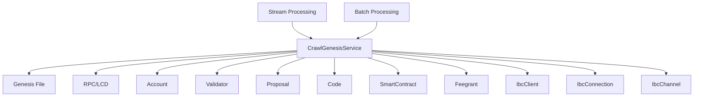
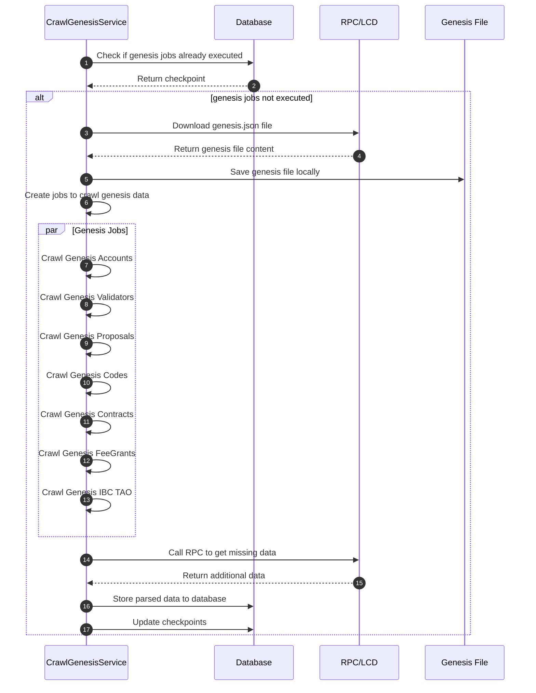
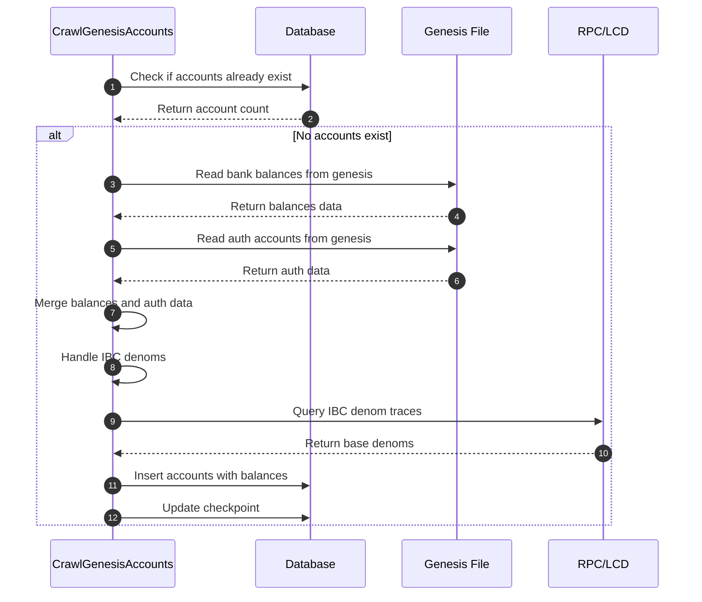
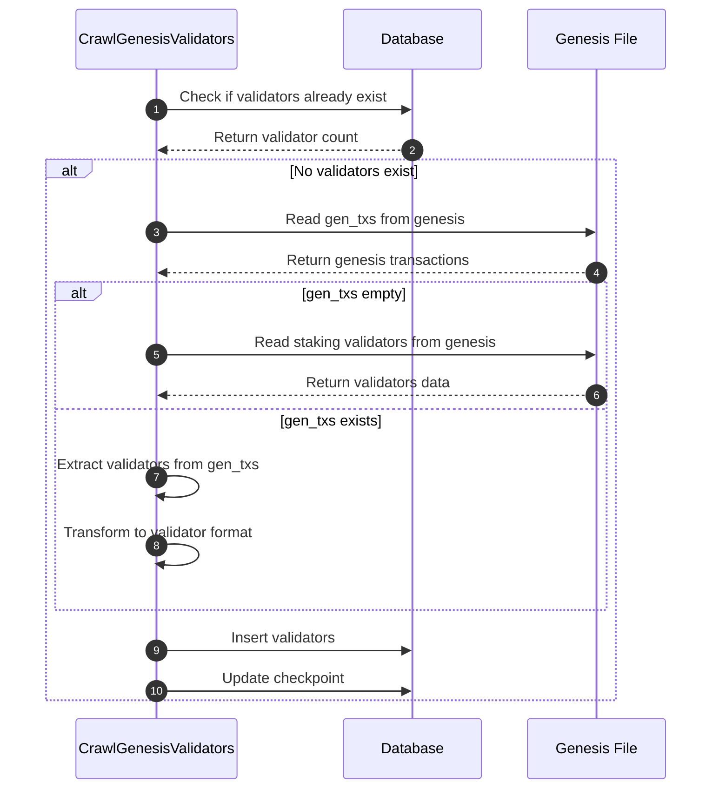
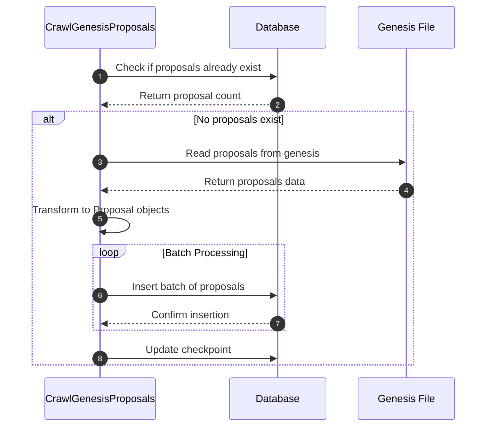
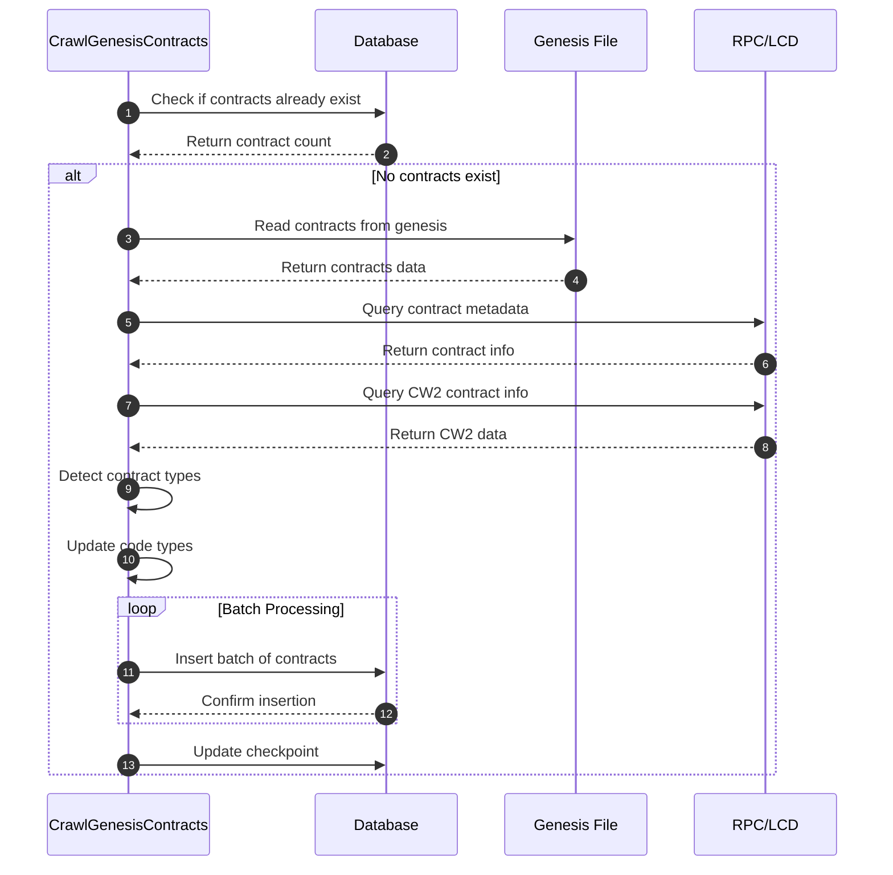
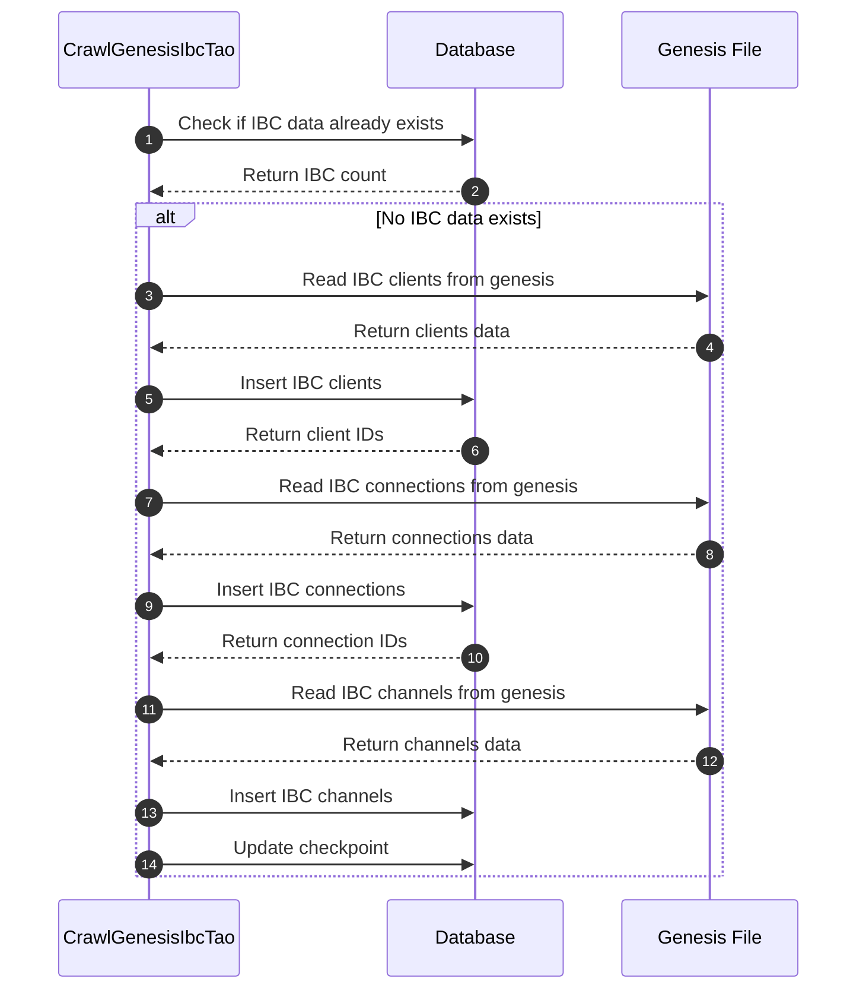

# Crawl Genesis Service

Dịch vụ crawl và xử lý dữ liệu genesis (dữ liệu ban đầu) của blockchain trong hệ thống indexer Cosmos modules.

## Tổng quan

Service Crawl Genesis chịu trách nhiệm crawl và xử lý dữ liệu ban đầu từ genesis file của blockchain, bao gồm:

1. **Accounts** - Tài khoản và balances ban đầu
2. **Validators** - Validators và thông tin staking
3. **Proposals** - Governance proposals
4. **Codes** - WASM codes
5. **Contracts** - Smart contracts
6. **Fee Grants** - Fee grant allowances
7. **IBC TAO** - IBC clients, connections, channels

## Kiến trúc tổng thể



## Quy trình xử lý chính



## Các Job Genesis

### 1. Crawl Genesis Accounts

**Chức năng:**
- Parse dữ liệu accounts từ `app_state.bank.balances`
- Parse thông tin auth từ `app_state.auth.accounts`
- Xử lý IBC denoms
- Tạo accounts với balances ban đầu

**Quy trình xử lý:**



**Dữ liệu xử lý:**
- Account addresses và balances
- Account types (BaseAccount, ModuleAccount, etc.)
- Public keys
- Account numbers và sequences
- IBC denom conversions

### 2. Crawl Genesis Validators

**Chức năng:**
- Parse validators từ `app_state.genutil.gen_txs` hoặc `app_state.staking.validators`
- Tạo validators với thông tin staking ban đầu
- Xử lý consensus pubkeys và operator addresses

**Quy trình xử lý:**



**Dữ liệu xử lý:**
- Validator addresses và consensus addresses
- Staking amounts và shares
- Commission rates
- Descriptions và metadata
- Status (BOND_STATUS_BONDED)

### 3. Crawl Genesis Proposals

**Chức năng:**
- Parse governance proposals từ `app_state.gov.proposals`
- Tạo proposals với trạng thái ban đầu
- Xử lý batch insertion cho performance

**Quy trình xử lý:**



### 4. Crawl Genesis Codes

**Chức năng:**
- Parse WASM codes từ `app_state.wasm.codes`
- Tạo codes với thông tin creator và permissions
- Xử lý code hashes và instantiate permissions

**Dữ liệu xử lý:**
- Code IDs và creators
- Code hashes (base64 to hex)
- Instantiate permissions
- Store heights và hashes

### 5. Crawl Genesis Contracts

**Chức năng:**
- Parse smart contracts từ `app_state.wasm.contracts`
- Query contract metadata từ blockchain
- Detect contract types (CW20, CW721, etc.)
- Update code types based on contracts

**Quy trình xử lý:**



### 6. Crawl Genesis FeeGrants

**Chức năng:**
- Parse fee grants từ `app_state.feegrant.allowances`
- Xử lý các loại allowances (Basic, Periodic, etc.)
- Tạo fee grants với trạng thái ban đầu

**Dữ liệu xử lý:**
- Granter và grantee addresses
- Allowance types
- Spend limits và denoms
- Expiration dates
- Status (AVAILABLE)

### 7. Crawl Genesis IBC TAO

**Chức năng:**
- Parse IBC clients từ `app_state.ibc.client_genesis`
- Parse IBC connections từ `app_state.ibc.connection_genesis`
- Parse IBC channels từ `app_state.ibc.channel_genesis`
- Tạo IBC infrastructure ban đầu

**Quy trình xử lý:**



## Xử lý Genesis File

### Genesis File Download

Service hỗ trợ 2 cách download genesis file:

1. **Single Request**: Download toàn bộ genesis file một lần
2. **Chunked Request**: Download genesis file theo chunks khi file quá lớn

```typescript
// Single request
const genesis = await this._httpBatchClient.execute(
  createJsonRpcRequest('genesis')
);

// Chunked request
let index = 0;
let done = false;
while (!done) {
  const resultChunk = await this._httpBatchClient.execute(
    createJsonRpcRequest('genesis_chunked', {
      chunk: index.toString(),
    })
  );
  // Process chunk
  index += 1;
}
```

### Stream Processing

Service sử dụng stream processing để xử lý genesis file hiệu quả:

```typescript
private async readStreamGenesis(
  data: string,
  filter?: (data: any) => void
): Promise<any> {
  const pipeline = Chain.chain([
    fs.createReadStream('genesis.json'),
    Pick.withParser({ filter: data }),
    StreamArr.withParser(),
  ]);
  
  return new Promise((resolve, reject) => {
    const result: any[] = [];
    pipeline.on('data', (data) => {
      if (filter) filter(data);
      result.push(data);
    });
    pipeline.on('end', () => resolve(result));
    pipeline.on('error', reject);
  });
}
```

## Xử lý IBC Denoms

Service tự động xử lý IBC denoms trong account balances:

```typescript
private async handleIbcDenom(accounts: Account[]): Promise<Account[]> {
  // Extract IBC denoms
  const ibcDenoms = accounts.flatMap(account =>
    account.balances
      .filter(balance => balance.denom.startsWith('ibc/'))
      .map(balance => balance.denom)
  );
  
  // Query denom traces
  const denomTraces = await Promise.all(
    ibcDenoms.map(hash =>
      this._httpBatchClient.execute(
        createJsonRpcRequest('abci_query', {
          path: ABCI_QUERY_PATH.DENOM_TRACE,
          data: toHex(QueryDenomTraceRequest.encode({ hash }).finish()),
        })
      )
    )
  );
  
  // Update base denoms
  accounts.forEach(account => {
    account.balances.forEach(balance => {
      if (balance.denom.startsWith('ibc/')) {
        balance.base_denom = denomTrace.baseDenom;
      }
    });
  });
  
  return accounts;
}
```

## Batch Processing

Service sử dụng batch processing để tối ưu performance:

```typescript
// Batch insert proposals
await Promise.all(
  _.chunk(proposals, config.crawlGenesis.proposalsPerBatch).map(
    async (chunkProposals, index) => {
      await Proposal.query()
        .insert(chunkProposals)
        .onConflict('proposal_id')
        .merge()
        .transacting(trx);
    }
  )
);
```

## Job Management

### Checkpoint System

Service sử dụng checkpoint system để đảm bảo idempotency:

```typescript
private async checkGenesisJobProcess(jobName: string): Promise<number> {
  const genesisCheckpoint = await BlockCheckpoint.query()
    .select('*')
    .whereIn('job_name', [BULL_JOB_NAME.CRAWL_GENESIS, jobName]);
    
  // Check if genesis job is still processing
  if (genesisCheckpoint.find(
    check => check.job_name === BULL_JOB_NAME.CRAWL_GENESIS
  )?.height !== 1) {
    return 1; // Still processing
  }
  
  // Check if specific job already completed
  if (genesisCheckpoint.find(
    check => check.job_name === jobName
  )?.height === 1) {
    return 2; // Already completed
  }
  
  return 0; // Ready to process
}
```

### Job Dependencies

Các job được thực hiện theo thứ tự:

1. `CRAWL_GENESIS` - Main genesis job (trigger các job con)
2. `CRAWL_GENESIS_ACCOUNT` - Crawl accounts
3. `CRAWL_GENESIS_VALIDATOR` - Crawl validators
4. `CRAWL_GENESIS_PROPOSAL` - Crawl proposals
5. `CRAWL_GENESIS_CODE` - Crawl codes
6. `CRAWL_GENESIS_CONTRACT` - Crawl contracts
7. `CRAWL_GENESIS_FEEGRANT` - Crawl fee grants
8. `CRAWL_GENESIS_IBC_TAO` - Crawl IBC data

## Cấu hình

```json
{
  "crawlGenesis": {
    "proposalsPerBatch": 100,
    "codesPerBatch": 50,
    "smartContractsPerBatch": 50,
    "feeGrantsPerBatch": 100
  },
  "jobRetryAttempt": 3,
  "jobRetryBackoff": 1000
}
```

## Error Handling

- **Retry Mechanism**: Bull queue retry cho các job thất bại
- **Checkpoint Validation**: Kiểm tra trạng thái trước khi xử lý
- **Graceful Degradation**: Tiếp tục xử lý khi một số dữ liệu lỗi
- **Transaction Rollback**: Rollback khi có lỗi trong batch processing

## Performance Optimization

- **Stream Processing**: Xử lý genesis file theo stream
- **Batch Processing**: Insert dữ liệu theo batches
- **Parallel Processing**: Xử lý các job song song
- **Memory Management**: Xử lý file lớn hiệu quả
- **Caching**: Cache IBC denom traces

## Monitoring

- **Job Status**: Monitor trạng thái các genesis jobs
- **Processing Time**: Theo dõi thời gian xử lý
- **Data Counts**: Kiểm tra số lượng dữ liệu đã xử lý
- **Error Tracking**: Theo dõi lỗi trong quá trình xử lý

## Dependencies

- Moleculer framework
- Bull queue system
- Knex.js cho database operations
- Objection.js cho ORM
- @cosmjs/tendermint-rpc cho RPC calls
- stream-json cho stream processing
- lodash cho data manipulation

## Sử dụng

### Manual Trigger

```typescript
// Trigger genesis crawl manually
await this.broker.call('v1.crawl-genesis.handleGenesis', {});
```

### Automatic Trigger

Genesis crawl được trigger tự động khi service start:

```typescript
public async _start() {
  await this.createJob(
    BULL_JOB_NAME.CRAWL_GENESIS,
    BULL_JOB_NAME.CRAWL_GENESIS,
    {},
    {
      removeOnComplete: true,
      removeOnFail: { count: 3 },
    }
  );
  return super._start();
}
```

## Lưu ý quan trọng

1. **One-time Execution**: Genesis crawl chỉ chạy một lần duy nhất
2. **Large File Handling**: Hỗ trợ genesis file lớn qua chunked download
3. **Data Consistency**: Đảm bảo tính nhất quán của dữ liệu ban đầu
4. **Performance**: Tối ưu cho việc xử lý dữ liệu lớn
5. **Error Recovery**: Có thể retry khi có lỗi 