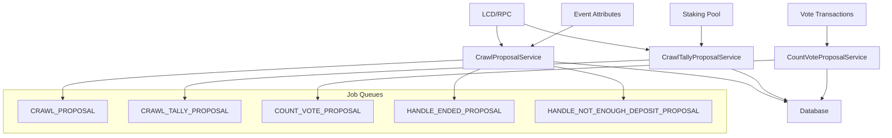
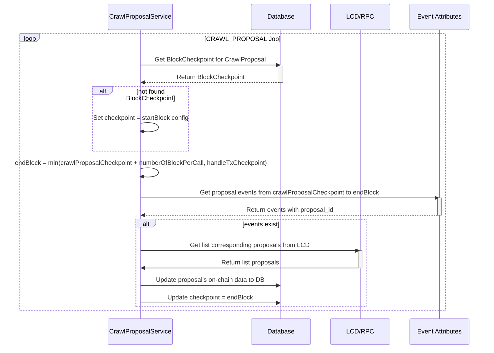
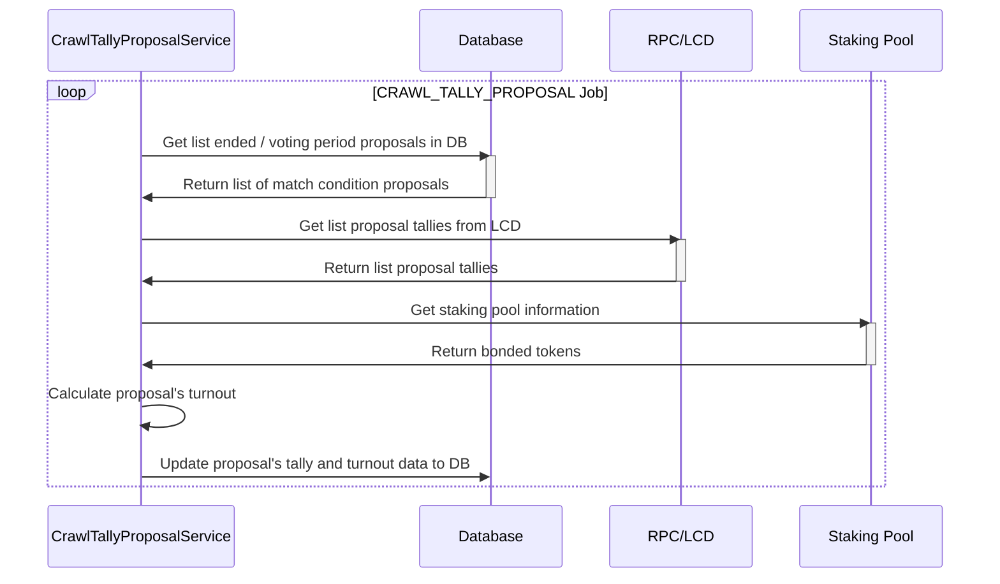
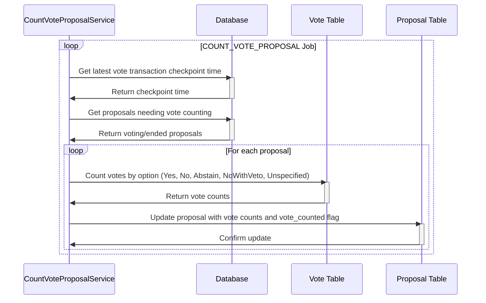

# Crawl Proposal Service

The Crawl Proposal Service is responsible for crawling and managing governance proposals on Cosmos-based blockchains. It consists of three main services that work together to provide comprehensive proposal tracking and analysis.

## Architecture Overview



## Services

### 1. CrawlProposalService

**Service Name**: `v1.crawl-proposal`

**Purpose**: Crawls new proposals from the blockchain and manages proposal lifecycle.

#### Key Features

- **Proposal Detection**: Monitors blockchain events to detect new proposals
- **Proposal Data Crawling**: Fetches detailed proposal information from LCD/RPC
- **Status Management**: Tracks proposal status changes (deposit period, voting period, passed, rejected, failed)
- **Deposit Tracking**: Monitors proposal deposits and handles insufficient deposit scenarios
- **Version Compatibility**: Supports both Cosmos SDK v0.45.99 and newer versions

#### Job Queues

| Job Name | Description | Frequency |
|----------|-------------|-----------|
| `CRAWL_PROPOSAL` | Crawl new proposals from blockchain | Configurable interval |
| `HANDLE_ENDED_PROPOSAL` | Update status of ended proposals | Configurable interval |
| `HANDLE_NOT_ENOUGH_DEPOSIT_PROPOSAL` | Handle proposals with insufficient deposits | Configurable interval |

#### Data Flow



#### Configuration

```json
{
  "crawlProposal": {
    "key": "numberOfBlockPerCall",
    "crawlProposal": {
      "millisecondCrawl": 5000
    },
    "handleEndedProposal": {
      "millisecondCrawl": 10000
    },
    "handleNotEnoughDepositProposal": {
      "millisecondCrawl": 15000
    }
  }
}
```

### 2. CrawlTallyProposalService

**Service Name**: `v1.crawl-tally-proposal`

**Purpose**: Updates proposal tally results and calculates voter turnout.

#### Key Features

- **Tally Updates**: Fetches real-time tally results from blockchain
- **Turnout Calculation**: Calculates voter participation percentage
- **Batch Processing**: Efficiently processes multiple proposals
- **Status Monitoring**: Tracks proposals in voting period and recently ended proposals

#### Job Queue

| Job Name | Description | Frequency |
|----------|-------------|-----------|
| `CRAWL_TALLY_PROPOSAL` | Update proposal tallies and turnout | Configurable interval |

#### Data Flow



#### Configuration

```json
{
  "crawlTallyProposal": {
    "millisecondCrawl": 10000
  }
}
```

### 3. CountVoteProposalService

**Service Name**: `v1.count-vote-proposal`

**Purpose**: Counts individual votes for proposals and updates vote statistics.

#### Key Features

- **Vote Counting**: Counts votes by option (Yes, No, Abstain, NoWithVeto, Unspecified)
- **Transaction Integration**: Links votes to transaction data
- **Checkpoint Synchronization**: Uses vote transaction checkpoint for consistency
- **Batch Processing**: Efficiently processes multiple proposals

#### Job Queue

| Job Name | Description | Frequency |
|----------|-------------|-----------|
| `COUNT_VOTE_PROPOSAL` | Count votes for proposals | Configurable interval |

#### Data Flow



#### Configuration

```json
{
  "countVoteProposal": {
    "millisecondCrawl": 15000
  }
}
```

## Database Schema

### Proposal Table

| Column | Type | Description |
|--------|------|-------------|
| `proposal_id` | INTEGER | Primary key, proposal ID on blockchain |
| `proposer_address` | VARCHAR | Address of proposal creator |
| `voting_start_time` | TIMESTAMP | When voting period starts |
| `voting_end_time` | TIMESTAMP | When voting period ends |
| `submit_time` | TIMESTAMP | When proposal was submitted |
| `deposit_end_time` | TIMESTAMP | When deposit period ends |
| `type` | VARCHAR | Proposal type (e.g., TextProposal, ParameterChangeProposal) |
| `title` | VARCHAR | Proposal title |
| `description` | TEXT | Proposal description |
| `content` | JSONB | Full proposal content |
| `status` | VARCHAR | Current status (DEPOSIT_PERIOD, VOTING_PERIOD, PASSED, etc.) |
| `tally` | JSONB | Vote tally results |
| `initial_deposit` | JSONB | Initial deposit amount |
| `total_deposit` | JSONB | Total deposit amount |
| `turnout` | FLOAT | Voter participation percentage |
| `count_vote` | JSONB | Count of votes by option |
| `vote_counted` | BOOLEAN | Whether votes have been counted |
| `created_at` | TIMESTAMP | Record creation time |
| `updated_at` | TIMESTAMP | Record update time |

### Vote Table

| Column | Type | Description |
|--------|------|-------------|
| `id` | SERIAL | Primary key |
| `voter` | VARCHAR | Voter address |
| `tx_id` | INTEGER | Reference to transaction |
| `vote_option` | VARCHAR | Vote choice (YES, NO, ABSTAIN, NO_WITH_VETO, UNSPECIFIED) |
| `proposal_id` | INTEGER | Reference to proposal |
| `txhash` | VARCHAR | Transaction hash |
| `height` | INTEGER | Block height |
| `created_at` | TIMESTAMP | Record creation time |
| `updated_at` | TIMESTAMP | Record update time |

## Proposal Status Types

```typescript
enum ProposalStatus {
  PROPOSAL_STATUS_UNSPECIFIED = 'PROPOSAL_STATUS_UNSPECIFIED',
  PROPOSAL_STATUS_DEPOSIT_PERIOD = 'PROPOSAL_STATUS_DEPOSIT_PERIOD',
  PROPOSAL_STATUS_VOTING_PERIOD = 'PROPOSAL_STATUS_VOTING_PERIOD',
  PROPOSAL_STATUS_PASSED = 'PROPOSAL_STATUS_PASSED',
  PROPOSAL_STATUS_REJECTED = 'PROPOSAL_STATUS_REJECTED',
  PROPOSAL_STATUS_FAILED = 'PROPOSAL_STATUS_FAILED',
  PROPOSAL_STATUS_NOT_ENOUGH_DEPOSIT = 'PROPOSAL_STATUS_NOT_ENOUGH_DEPOSIT'
}
```

## Vote Options

```typescript
enum VoteOption {
  VOTE_OPTION_UNSPECIFIED = 'VOTE_OPTION_UNSPECIFIED',
  VOTE_OPTION_YES = 'VOTE_OPTION_YES',
  VOTE_OPTION_ABSTAIN = 'VOTE_OPTION_ABSTAIN',
  VOTE_OPTION_NO = 'VOTE_OPTION_NO',
  VOTE_OPTION_NO_WITH_VETO = 'VOTE_OPTION_NO_WITH_VETO'
}
```

## Job Queue Dependencies

The proposal services have specific dependencies on other services:

1. **CrawlProposalService** depends on:
   - `HANDLE_TRANSACTION` - For block checkpoint synchronization

2. **CountVoteProposalService** depends on:
   - `HANDLE_VOTE_TX` - For vote transaction processing

## Error Handling

### Common Error Scenarios

1. **Proposal Not Found**: When a proposal ID exists in events but not on blockchain
   - Handled gracefully with warning logs
   - Continues processing other proposals

2. **LCD/RPC Errors**: Network or service unavailability
   - Retry mechanism with exponential backoff
   - Job failure handling with retry limits

3. **Database Errors**: Constraint violations or connection issues
   - Transaction rollback on errors
   - Detailed error logging for debugging

### Error Recovery

- Jobs are configured with retry mechanisms
- Failed jobs are preserved for analysis (up to 3 failures)
- Checkpoint system ensures no data loss on restart

## Monitoring and Metrics

### Key Metrics to Monitor

1. **Proposal Processing Rate**: Number of proposals processed per minute
2. **Vote Counting Accuracy**: Comparison with on-chain data
3. **Job Queue Health**: Queue length and processing times
4. **Error Rates**: Failed jobs and error types
5. **Database Performance**: Query execution times

### Logging

Services provide detailed logging for:
- Proposal discovery and processing
- Vote counting operations
- Tally updates and turnout calculations
- Error conditions and recovery actions

## API Integration

### GraphQL Queries

```graphql
# Get all proposals
query GetProposals {
  proposal {
    proposal_id
    title
    description
    status
    voting_start_time
    voting_end_time
    tally
    turnout
    count_vote
  }
}

# Get specific proposal with votes
query GetProposalWithVotes($proposalId: Int!) {
  proposal(where: {proposal_id: {_eq: $proposalId}}) {
    proposal_id
    title
    description
    status
    tally
    turnout
    count_vote
  }
  vote(where: {proposal_id: {_eq: $proposalId}}) {
    voter
    vote_option
    txhash
    height
  }
}

# Get proposals by status
query GetProposalsByStatus($status: String!) {
  proposal(where: {status: {_eq: $status}}) {
    proposal_id
    title
    status
    voting_end_time
    turnout
  }
}
```

### REST API Endpoints

The proposal data is accessible through Hasura GraphQL API with the following permissions:
- **Public**: Read access to all proposal data
- **Internal Service**: Read access with aggregation capabilities

## Performance Considerations

### Optimization Strategies

1. **Batch Processing**: Multiple proposals processed in single transactions
2. **Checkpoint System**: Prevents reprocessing of already handled blocks
3. **Indexed Queries**: Database indexes on frequently queried columns
4. **Efficient Filtering**: Smart queries to only process relevant proposals

### Scalability

- Services can be horizontally scaled
- Job queues support multiple workers
- Database partitioning for large datasets
- Caching strategies for frequently accessed data

## Dependencies

### External Dependencies

- **LCD/RPC Client**: For blockchain data access
- **Cosmos SDK**: For proposal and vote data structures
- **Database**: PostgreSQL for data storage
- **Job Queue**: Bull/BullMQ for task management

### Internal Dependencies

- **BlockCheckpoint**: For synchronization
- **EventAttribute**: For proposal event detection
- **Transaction**: For vote transaction linking
- **Block**: For checkpoint time synchronization

## Configuration Examples

### Development Configuration

```json
{
  "crawlProposal": {
    "key": 100,
    "crawlProposal": {
      "millisecondCrawl": 10000
    },
    "handleEndedProposal": {
      "millisecondCrawl": 20000
    },
    "handleNotEnoughDepositProposal": {
      "millisecondCrawl": 30000
    }
  },
  "crawlTallyProposal": {
    "millisecondCrawl": 15000
  },
  "countVoteProposal": {
    "millisecondCrawl": 20000
  }
}
```

### Production Configuration

```json
{
  "crawlProposal": {
    "key": 50,
    "crawlProposal": {
      "millisecondCrawl": 5000
    },
    "handleEndedProposal": {
      "millisecondCrawl": 10000
    },
    "handleNotEnoughDepositProposal": {
      "millisecondCrawl": 15000
    }
  },
  "crawlTallyProposal": {
    "millisecondCrawl": 10000
  },
  "countVoteProposal": {
    "millisecondCrawl": 15000
  }
}
```

## Troubleshooting

### Common Issues

1. **Proposals Not Being Crawled**
   - Check if `HANDLE_TRANSACTION` job is running
   - Verify block checkpoint synchronization
   - Check for proposal events in event attributes

2. **Vote Counts Not Updating**
   - Ensure `HANDLE_VOTE_TX` job is processing vote transactions
   - Check vote transaction checkpoint time
   - Verify vote records exist in database

3. **Tally Results Not Updating**
   - Check LCD/RPC connectivity
   - Verify staking pool data availability
   - Check for proposals in voting period

### Debug Commands

```bash
# Check job queue status
curl -X GET "http://localhost:3000/api/queues"

# View job logs
curl -X GET "http://localhost:3000/api/jobs/{jobId}/logs"

# Check database connections
psql -h localhost -U username -d database -c "SELECT * FROM proposal ORDER BY created_at DESC LIMIT 5;"
```

## Future Enhancements

1. **Real-time Notifications**: WebSocket support for proposal updates
2. **Advanced Analytics**: Proposal success rate analysis
3. **Multi-chain Support**: Unified proposal tracking across chains
4. **Enhanced Monitoring**: Prometheus metrics integration
5. **Caching Layer**: Redis caching for frequently accessed data 