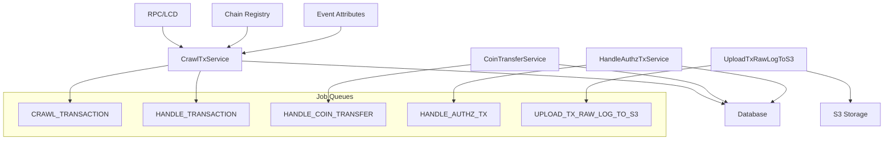
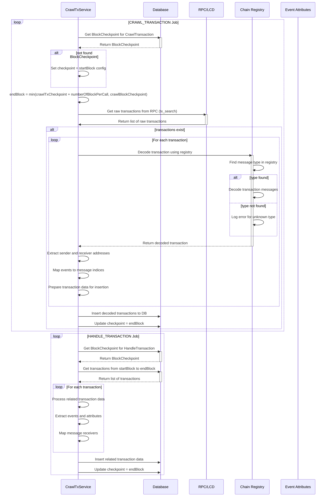
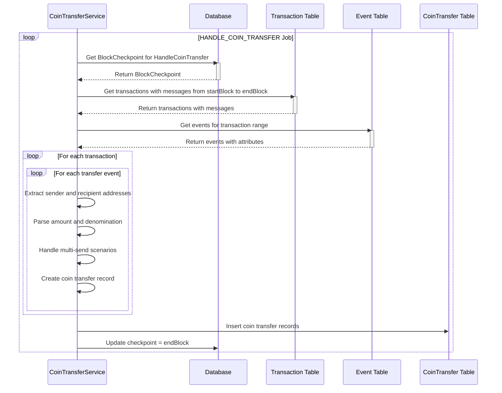
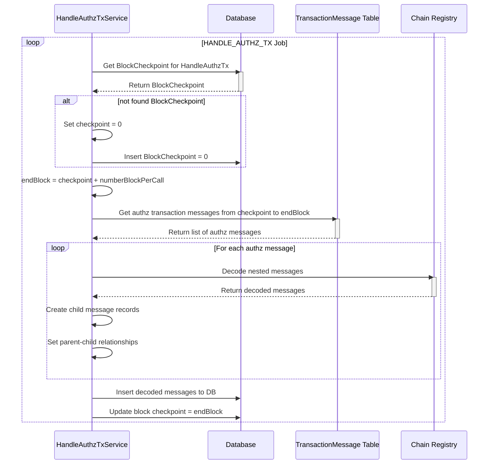
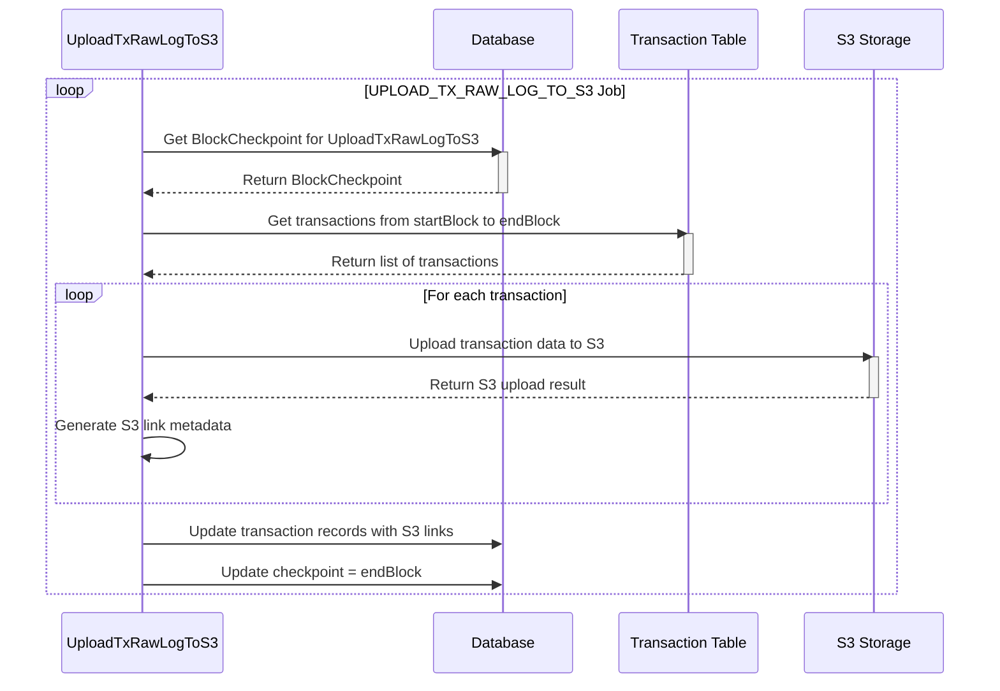

# Crawl Transaction Service

The Crawl Transaction Service is responsible for crawling, processing, and managing blockchain transactions on Cosmos-based networks. It consists of four main services that work together to provide comprehensive transaction tracking, decoding, and analysis.

## Architecture Overview



## Services

### 1. CrawlTxService

**Service Name**: `v1.crawl-transaction`

**Purpose**: Crawls raw transactions from blockchain and decodes them into structured data.

#### Key Features

- **Transaction Crawling**: Fetches raw transaction data from RPC endpoints
- **Message Decoding**: Decodes transaction messages using chain registry
- **Event Processing**: Extracts and processes transaction events
- **Batch Processing**: Efficiently processes multiple transactions
- **Registry Integration**: Uses chain-specific message type registries
- **Checkpoint Management**: Maintains processing checkpoints for consistency

#### Job Queues

| Job Name | Description | Frequency |
|----------|-------------|-----------|
| `CRAWL_TRANSACTION` | Crawl raw transactions from blockchain | Configurable interval |
| `HANDLE_TRANSACTION` | Process and decode transaction data | Configurable interval |

#### Data Flow



#### Configuration

```json
{
  "crawlTransaction": {
    "key": "numberOfBlockPerCall",
    "millisecondCrawl": 5000
  },
  "handleTransaction": {
    "key": "numberOfBlockPerCall",
    "txsPerCall": 100,
    "millisecondCrawl": 10000
  }
}
```

### 2. CoinTransferService

**Service Name**: `v1.coin-transfer`

**Purpose**: Extracts and processes coin transfer events from transactions.

#### Key Features

- **Transfer Detection**: Identifies coin transfer events in transactions
- **Amount Parsing**: Extracts amount and denomination from transfer events
- **Multi-Send Support**: Handles both single and multi-recipient transfers
- **Authz Integration**: Processes authorized transfer messages
- **Batch Processing**: Efficiently processes multiple transactions

#### Job Queue

| Job Name | Description | Frequency |
|----------|-------------|-----------|
| `HANDLE_COIN_TRANSFER` | Process coin transfer events | Configurable interval |

#### Data Flow



#### Configuration

```json
{
  "handleCoinTransfer": {
    "key": "numberOfBlockPerCall",
    "millisecondCrawl": 15000
  }
}
```

### 3. HandleAuthzTxService

**Service Name**: `v1.handle-authz-tx`

**Purpose**: Processes authorized transaction messages and extracts nested messages.

#### Key Features

- **Authz Message Processing**: Handles authorized execution messages
- **Nested Message Extraction**: Extracts and processes nested messages
- **Parent-Child Relationships**: Maintains message hierarchy
- **Batch Processing**: Efficiently processes multiple authz messages

#### Job Queue

| Job Name | Description | Frequency |
|----------|-------------|-----------|
| `HANDLE_AUTHZ_TX` | Process authorized transaction messages | Configurable interval |

#### Data Flow



#### Configuration

```json
{
  "handleAuthzTx": {
    "key": "numberOfBlockPerCall",
    "millisecondCrawl": 20000
  }
}
```

### 4. UploadTxRawLogToS3

**Service Name**: `v1.upload-tx-raw-log-to-s3`

**Purpose**: Uploads transaction raw logs to S3 storage for archival and analysis.

#### Key Features

- **S3 Integration**: Uploads transaction data to AWS S3
- **Organized Storage**: Structures data by chain, height, and transaction hash
- **Batch Upload**: Efficiently uploads multiple transactions
- **Metadata Tracking**: Updates transaction records with S3 links
- **Configurable Overwrite**: Controls whether to overwrite existing files

#### Job Queue

| Job Name | Description | Frequency |
|----------|-------------|-----------|
| `UPLOAD_TX_RAW_LOG_TO_S3` | Upload transaction raw logs to S3 | Configurable interval |

#### Data Flow



#### Configuration

```json
{
  "uploadTransactionRawLogToS3": {
    "key": "numberOfBlockPerCall",
    "overwriteS3IfFound": false,
    "returnIfFound": true,
    "millisecondCrawl": 30000
  }
}
```

## Database Schema

### Transaction Table

| Column | Type | Description |
|--------|------|-------------|
| `id` | SERIAL | Primary key |
| `height` | INTEGER | Block height |
| `hash` | VARCHAR | Transaction hash |
| `codespace` | VARCHAR | Transaction codespace |
| `code` | INTEGER | Transaction result code |
| `gas_used` | VARCHAR | Gas used by transaction |
| `gas_wanted` | VARCHAR | Gas wanted by transaction |
| `gas_limit` | VARCHAR | Gas limit |
| `fee` | VARCHAR | Transaction fee |
| `memo` | TEXT | Transaction memo |
| `index` | INTEGER | Transaction index in block |
| `timestamp` | TIMESTAMP | Transaction timestamp |
| `data` | JSONB | Raw transaction data |
| `created_at` | TIMESTAMP | Record creation time |
| `updated_at` | TIMESTAMP | Record update time |

### TransactionMessage Table

| Column | Type | Description |
|--------|------|-------------|
| `id` | SERIAL | Primary key |
| `tx_id` | INTEGER | Reference to transaction |
| `index` | INTEGER | Message index in transaction |
| `type` | VARCHAR | Message type |
| `sender` | VARCHAR | Message sender address |
| `content` | JSONB | Decoded message content |
| `parent_id` | INTEGER | Reference to parent message (for authz) |
| `created_at` | TIMESTAMP | Record creation time |
| `updated_at` | TIMESTAMP | Record update time |

### CoinTransfer Table

| Column | Type | Description |
|--------|------|-------------|
| `id` | SERIAL | Primary key |
| `block_height` | INTEGER | Block height |
| `tx_id` | INTEGER | Reference to transaction |
| `tx_msg_id` | INTEGER | Reference to transaction message |
| `from` | VARCHAR | Sender address |
| `to` | VARCHAR | Recipient address |
| `amount` | VARCHAR | Transfer amount |
| `denom` | VARCHAR | Token denomination |
| `timestamp` | TIMESTAMP | Transfer timestamp |
| `created_at` | TIMESTAMP | Record creation time |
| `updated_at` | TIMESTAMP | Record update time |

### Event Table

| Column | Type | Description |
|--------|------|-------------|
| `id` | SERIAL | Primary key |
| `tx_id` | INTEGER | Reference to transaction |
| `block_height` | INTEGER | Block height |
| `tx_msg_index` | INTEGER | Message index |
| `type` | VARCHAR | Event type |
| `source` | VARCHAR | Event source |
| `created_at` | TIMESTAMP | Record creation time |
| `updated_at` | TIMESTAMP | Record update time |

### EventAttribute Table

| Column | Type | Description |
|--------|------|-------------|
| `id` | SERIAL | Primary key |
| `event_id` | INTEGER | Reference to event |
| `key` | VARCHAR | Attribute key |
| `value` | TEXT | Attribute value |
| `tx_id` | INTEGER | Reference to transaction |
| `created_at` | TIMESTAMP | Record creation time |
| `updated_at` | TIMESTAMP | Record update time |

## Message Type Registry

The service uses chain-specific registries to decode transaction messages. Each network has its own registry file:

### Aura Network Registry (`aura-network.json`)

```json
[
  "/cosmos.gov.v1beta1.MsgSubmitProposal",
  "/cosmos.upgrade.v1beta1.SoftwareUpgradeProposal",
  "/cosmos.distribution.v1beta1.CommunityPoolSpendProposal",
  "/cosmos.params.v1beta1.ParameterChangeProposal",
  "/ibc.core.client.v1.UpgradeProposal",
  "/cosmos.feegrant.v1beta1.BasicAllowance",
  "/cosmos.vesting.v1beta1.MsgCreatePeriodicVestingAccount",
  "/ibc.lightclients.tendermint.v1.Header",
  "/cosmos.slashing.v1beta1.MsgUnjail",
  "/aura.smartaccount.v1beta1.MsgActivateAccount",
  "/ethermint.evm.v1.MsgEthereumTx",
  "/evmos.erc20.v1.MsgConvertCoin"
]
```

### Supported Message Types

1. **Governance Messages**: Proposal submission, parameter changes
2. **Bank Messages**: Coin transfers, multi-send operations
3. **Staking Messages**: Delegation, unbonding, redelegation
4. **IBC Messages**: Cross-chain transfers, client updates
5. **Smart Contract Messages**: CosmWasm instantiate, execute
6. **Authz Messages**: Authorized execution
7. **Custom Messages**: Chain-specific message types

## Job Queue Dependencies

The transaction services have specific dependencies on other services:

1. **CrawlTxService** depends on:
   - `CRAWL_BLOCK` - For block checkpoint synchronization

2. **CoinTransferService** depends on:
   - `HANDLE_TRANSACTION` - For transaction processing completion

3. **HandleAuthzTxService** depends on:
   - `HANDLE_TRANSACTION` - For transaction message processing

4. **UploadTxRawLogToS3** depends on:
   - `HANDLE_TRANSACTION` - For transaction processing completion

## Error Handling

### Common Error Scenarios

1. **Unknown Message Types**: When message type is not in registry
   - Logged as error with message type
   - Transaction processing continues
   - Raw data preserved in database

2. **RPC/LCD Errors**: Network or service unavailability
   - Retry mechanism with exponential backoff
   - Job failure handling with retry limits

3. **Decoding Errors**: Invalid transaction data
   - Error logged with transaction hash
   - Raw data preserved for analysis
   - Processing continues with other transactions

4. **S3 Upload Errors**: Storage service issues
   - Individual transaction upload failures logged
   - Batch processing continues
   - Retry mechanism for failed uploads

### Error Recovery

- Jobs are configured with retry mechanisms
- Failed jobs are preserved for analysis (up to 3 failures)
- Checkpoint system ensures no data loss on restart
- Raw transaction data preserved even if decoding fails

## Performance Considerations

### Optimization Strategies

1. **Batch Processing**: Multiple transactions processed in single operations
2. **Checkpoint System**: Prevents reprocessing of already handled blocks
3. **Indexed Queries**: Database indexes on frequently queried columns
4. **Efficient Filtering**: Smart queries to only process relevant data
5. **Parallel Processing**: Concurrent processing of independent operations

### Scalability

- Services can be horizontally scaled
- Job queues support multiple workers
- Database partitioning for large datasets
- S3 storage for archival data

## Monitoring and Metrics

### Key Metrics to Monitor

1. **Transaction Processing Rate**: Number of transactions processed per minute
2. **Message Decoding Success Rate**: Percentage of successfully decoded messages
3. **Job Queue Health**: Queue length and processing times
4. **Error Rates**: Failed jobs and error types
5. **Database Performance**: Query execution times
6. **S3 Upload Performance**: Upload success rate and latency

### Logging

Services provide detailed logging for:
- Transaction discovery and processing
- Message decoding operations
- Event extraction and processing
- Error conditions and recovery actions
- Performance metrics and bottlenecks

## API Integration

### GraphQL Queries

```graphql
# Get transactions with messages
query GetTransactions($limit: Int!) {
  transaction(limit: $limit, order_by: {height: desc}) {
    id
    hash
    height
    code
    gas_used
    gas_wanted
    fee
    timestamp
    transaction_messages {
      id
      index
      type
      sender
      content
    }
    events {
      id
      type
      tx_msg_index
      event_attributes {
        key
        value
      }
    }
  }
}

# Get coin transfers
query GetCoinTransfers($fromAddress: String!) {
  coin_transfer(where: {from: {_eq: $fromAddress}}) {
    id
    block_height
    from
    to
    amount
    denom
    timestamp
    transaction {
      hash
      height
    }
  }
}

# Get transactions by message type
query GetTransactionsByType($messageType: String!) {
  transaction_message(where: {type: {_eq: $messageType}}) {
    id
    type
    sender
    content
    transaction {
      hash
      height
      timestamp
    }
  }
}
```

### REST API Endpoints

The transaction data is accessible through Hasura GraphQL API with the following permissions:
- **Public**: Read access to transaction data
- **Internal Service**: Read access with aggregation capabilities

## Configuration Examples

### Development Configuration

```json
{
  "crawlTransaction": {
    "key": 50,
    "millisecondCrawl": 10000
  },
  "handleTransaction": {
    "key": 50,
    "txsPerCall": 50,
    "millisecondCrawl": 15000
  },
  "handleCoinTransfer": {
    "key": 50,
    "millisecondCrawl": 20000
  },
  "handleAuthzTx": {
    "key": 50,
    "millisecondCrawl": 25000
  },
  "uploadTransactionRawLogToS3": {
    "key": 50,
    "overwriteS3IfFound": false,
    "returnIfFound": true,
    "millisecondCrawl": 30000
  }
}
```

### Production Configuration

```json
{
  "crawlTransaction": {
    "key": 100,
    "millisecondCrawl": 5000
  },
  "handleTransaction": {
    "key": 100,
    "txsPerCall": 100,
    "millisecondCrawl": 10000
  },
  "handleCoinTransfer": {
    "key": 100,
    "millisecondCrawl": 15000
  },
  "handleAuthzTx": {
    "key": 100,
    "millisecondCrawl": 20000
  },
  "uploadTransactionRawLogToS3": {
    "key": 100,
    "overwriteS3IfFound": false,
    "returnIfFound": true,
    "millisecondCrawl": 30000
  }
}
```

## Dependencies

### External Dependencies

- **RPC/LCD Client**: For blockchain data access
- **Cosmos SDK**: For transaction and message data structures
- **Database**: PostgreSQL for data storage
- **Job Queue**: Bull/BullMQ for task management
- **S3 Storage**: AWS S3 for raw log archival

### Internal Dependencies

- **BlockCheckpoint**: For synchronization
- **ChainRegistry**: For message type decoding
- **EventAttribute**: For event processing
- **Block**: For checkpoint synchronization

## Troubleshooting

### Common Issues

1. **Transactions Not Being Crawled**
   - Check if `CRAWL_BLOCK` job is running
   - Verify block checkpoint synchronization
   - Check RPC endpoint connectivity

2. **Message Decoding Failures**
   - Verify message type registry is up to date
   - Check for new message types in recent transactions
   - Review error logs for unknown message types

3. **Coin Transfers Not Processing**
   - Ensure `HANDLE_TRANSACTION` job is processing transactions
   - Check transaction message processing
   - Verify event attribute extraction

4. **S3 Upload Failures**
   - Check AWS credentials and permissions
   - Verify S3 bucket configuration
   - Check network connectivity to S3

### Debug Commands

```bash
# Check job queue status
curl -X GET "http://localhost:3000/api/queues"

# View job logs
curl -X GET "http://localhost:3000/api/jobs/{jobId}/logs"

# Check database connections
psql -h localhost -U username -d database -c "SELECT * FROM transaction ORDER BY created_at DESC LIMIT 5;"

# Check S3 upload status
aws s3 ls s3://bucket-name/rawlog/chain-name/chain-id/transaction/ --recursive
```

## Future Enhancements

1. **Real-time Processing**: WebSocket support for transaction updates
2. **Advanced Analytics**: Transaction pattern analysis
3. **Multi-chain Support**: Unified transaction tracking across chains
4. **Enhanced Monitoring**: Prometheus metrics integration
5. **Caching Layer**: Redis caching for frequently accessed data
6. **Streaming Processing**: Kafka integration for real-time data flow 