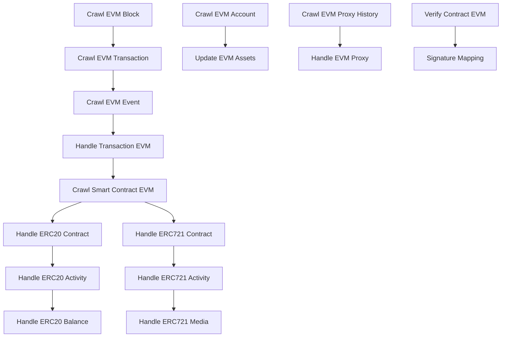

# EVM Service Module - Evmos Integration

## Tổng quan
Module EVM Service chịu trách nhiệm xử lý và lập chỉ mục các giao dịch EVM, smart contract và hoạt động token trên các blockchain Cosmos hỗ trợ EVM như Evmos. Module này cung cấp khả năng lập chỉ mục toàn diện cho giao dịch EVM, token ERC-20, NFT ERC-721, smart contract và các hoạt động liên quan.

## Kiến trúc

### Luồng xử lý dịch vụ


## Các dịch vụ chính

### 1. Xử lý Block và Transaction

#### Crawl EVM Block Service (`crawl_evm_block.service.ts`)
- Thu thập các block EVM từ blockchain
- Trích xuất metadata của block và thông tin giao dịch
- Duy trì checkpoint block để xử lý đáng tin cậy

#### Crawl EVM Transaction Service (`crawl_evm_transaction.service.ts`)
- Xử lý các giao dịch EVM từ block
- Trích xuất chi tiết giao dịch (from, to, value, gas, v.v.)
- Xử lý receipt và trạng thái giao dịch
- Hỗ trợ các tính năng đặc biệt của Optimism L2 (phí L1, giá gas)

#### Crawl EVM Event Service (`crawl_evm_event.service.ts`)
- Xử lý các event EVM từ transaction log
- Trích xuất event topic và data
- Duy trì chỉ mục event cho tương tác smart contract

### 2. Xử lý Smart Contract

#### Crawl Smart Contract EVM Service (`crawl_contract_evm.service.ts`)
- Phát hiện và xử lý triển khai smart contract
- Nhận dạng loại contract (ERC-20, ERC-721, ERC-1155)
- Xử lý phát hiện và quản lý proxy contract
- Hỗ trợ nhiều chuẩn proxy (EIP-1967, EIP-1822, OpenZeppelin)

#### Verify Contract EVM Service (`verify_contract_evm.service.ts`)
- Xác minh mã nguồn smart contract
- Tích hợp với Sourcify để xác minh contract
- Xử lý biên dịch contract và tạo ABI
- Quản lý yêu cầu và phản hồi xác minh

### 3. Xử lý Token

#### ERC-20 Service (`erc20.service.ts`)
- Xử lý các contract token ERC-20
- Xử lý chuyển token và phê duyệt
- Quản lý số dư token và hoạt động
- Hỗ trợ reindex token để cập nhật

#### ERC-721 Service (`erc721.service.ts`)
- Xử lý các contract NFT ERC-721
- Xử lý chuyển, mint và burn NFT
- Quản lý metadata và media NFT
- Theo dõi quyền sở hữu và thống kê NFT

### 4. Quản lý Account và Asset

#### Crawl EVM Account Service (`crawl_evm_account.service.ts`)
- Xử lý hoạt động tài khoản EVM
- Theo dõi số dư và giao dịch tài khoản
- Quản lý thống kê và phân tích tài khoản

#### Update Assets Service (`update_assets.service.ts`)
- Cập nhật thông tin và metadata asset
- Quản lý giá cả và dữ liệu thị trường asset
- Xử lý đồng bộ hóa asset

### 5. Xử lý Proxy và Internal Transaction

#### Crawl EVM Proxy History Service (`crawl_evm_proxy_history.service.ts`)
- Theo dõi thay đổi implementation của proxy contract
- Quản lý lịch sử nâng cấp proxy
- Xử lý đồng bộ hóa trạng thái proxy contract

#### EVM Crawl Internal Transaction Service (`evm_crawl_internal_tx.service.ts`)
- Xử lý internal transaction (contract call)
- Theo dõi tương tác giữa các contract
- Quản lý tracing internal transaction

## Các chuẩn được hỗ trợ

### Chuẩn ERC
- **ERC-20**: Token có thể thay thế với chức năng transfer và approval
- **ERC-721**: Token không thể thay thế với định danh duy nhất
- **ERC-1155**: Chuẩn multi-token (được phát hiện nhưng xử lý có thể khác nhau)

### Chuẩn Proxy
- **EIP-1967**: Slot implementation proxy chuẩn
- **EIP-1822**: Chuẩn universal upgradeable proxy
- **EIP-1167**: Chuẩn minimal proxy contract
- **OpenZeppelin**: Implementation proxy OpenZeppelin

## Schema Database

### Bảng chính
- `evm_block`: Thông tin block EVM
- `evm_transaction`: Chi tiết giao dịch EVM
- `evm_event`: Log event EVM
- `evm_smart_contract`: Thông tin smart contract
- `evm_account`: Dữ liệu tài khoản EVM

### Bảng Token
- `erc20_contract`: Chi tiết contract ERC-20
- `erc20_activity`: Hoạt động transfer ERC-20
- `erc20_balance`: Số dư token ERC-20
- `erc721_contract`: Chi tiết contract ERC-721
- `erc721_token`: Token NFT ERC-721
- `erc721_activity`: Hoạt động transfer ERC-721
- `erc721_holder_statistic`: Thống kê holder ERC-721

### Bảng Proxy
- `evm_proxy_history`: Lịch sử implementation proxy
- `evm_proxy`: Trạng thái proxy hiện tại

## Cấu hình

Module EVM có thể được cấu hình thông qua `config.json`:

```json
{
  "crawlEvmBlock": {
    "key": "crawl_evm_block",
    "millisecondCrawl": <khoảng_thời_gian_ms>
  },
  "crawlEvmTransaction": {
    "key": "crawl_evm_transaction",
    "chunkSize": <kích_thước_batch>,
    "additionalData": {
      "optimism": <boolean>
    }
  },
  "erc20": {
    "key": "handle_erc20",
    "chunkSizeInsert": <kích_thước_batch>,
    "millisecondCrawl": <khoảng_thời_gian_ms>
  },
  "erc721": {
    "key": "handle_erc721",
    "chunkSizeQuery": <kích_thước_batch>,
    "millisecondCrawl": <khoảng_thời_gian_ms>
  }
}
```

## Tính năng

### Xử lý Transaction
- Lập chỉ mục giao dịch EVM đầy đủ
- Theo dõi sử dụng gas và giá cả
- Giám sát trạng thái giao dịch
- Tracing internal transaction
- Hỗ trợ Optimism L2

### Hỗ trợ Smart Contract
- Phát hiện loại contract tự động
- Xử lý proxy contract
- Tích hợp xác minh contract
- Tạo và quản lý ABI
- Biên dịch mã nguồn

### Quản lý Token
- Lập chỉ mục token ERC-20
- Xử lý NFT ERC-721
- Theo dõi số dư token
- Giám sát hoạt động transfer
- Quản lý metadata token

### Theo dõi Account
- Giám sát tài khoản EVM
- Cập nhật số dư
- Lịch sử giao dịch
- Phân tích thống kê

### Hỗ trợ Proxy Contract
- Hỗ trợ nhiều chuẩn proxy
- Theo dõi nâng cấp implementation
- Quản lý trạng thái proxy
- Bảo tồn lịch sử

## Hệ thống Job Queue

Module EVM sử dụng hệ thống job queue phức tạp với các phụ thuộc:

### Job chính
- `CRAWL_EVM_BLOCK`: Thu thập block
- `CRAWL_EVM_TRANSACTION`: Xử lý transaction
- `CRAWL_EVM_EVENT`: Xử lý event
- `HANDLE_TRANSACTION_EVM`: Xử lý transaction

### Job Contract
- `CRAWL_SMART_CONTRACT_EVM`: Phát hiện contract
- `HANDLE_ERC20_CONTRACT`: Xử lý contract ERC-20
- `HANDLE_ERC721_CONTRACT`: Xử lý contract ERC-721

### Job Activity
- `HANDLE_ERC20_ACTIVITY`: Xử lý hoạt động ERC-20
- `HANDLE_ERC721_ACTIVITY`: Xử lý hoạt động ERC-721
- `HANDLE_ERC20_BALANCE`: Cập nhật số dư ERC-20
- `HANDLE_ERC721_MEDIA`: Xử lý metadata ERC-721

### Job Maintenance
- `REINDEX_ERC20`: Reindex ERC-20
- `REINDEX_ERC721`: Reindex ERC-721
- `UPDATE_EVM_ASSETS`: Cập nhật asset
- `SYNC_SOURCIFY`: Đồng bộ xác minh contract

## Xử lý lỗi

- **Logic Retry**: Job thất bại được thử lại tối đa 3 lần
- **Hệ thống Checkpoint**: Đảm bảo không mất dữ liệu khi có lỗi
- **Transaction Rollback**: Tính nhất quán database khi có lỗi
- **Graceful Degradation**: Tiếp tục xử lý khi có lỗi không nghiêm trọng

## Tối ưu hóa hiệu suất

- **Batch Processing**: Thao tác database bulk hiệu quả
- **Chunked Query**: Xử lý dataset lớn tiết kiệm bộ nhớ
- **Indexed Query**: Mẫu truy cập database được tối ưu
- **Parallel Processing**: Thực thi job đồng thời
- **Caching**: Cache dữ liệu smart contract

## Giám sát và Logging

### Mức độ Log
- **INFO**: Tiến trình xử lý và thống kê
- **DEBUG**: Thông tin chi tiết hoạt động
- **ERROR**: Điều kiện lỗi và thất bại
- **WARN**: Điều kiện cảnh báo và edge case

### Metrics
- Tốc độ xử lý block
- Throughput transaction
- Độ chính xác phát hiện contract
- Volume hoạt động token
- Tỷ lệ và loại lỗi

## Phụ thuộc

### Dịch vụ bên ngoài
- EVM RPC endpoint (Web3 provider)
- Dịch vụ xác minh Sourcify
- IPFS để lưu trữ metadata (tùy chọn)

### Phụ thuộc nội bộ
- Hệ thống block checkpoint
- Hệ thống Bull queue
- Pool kết nối database
- Viem client cho tương tác EVM

## Cân nhắc bảo mật

- **Validation Input**: Tất cả input được validate trước khi xử lý
- **Ngăn chặn SQL Injection**: Query có tham số
- **Rate Limiting**: Giới hạn tốc độ RPC call
- **Error Sanitization**: Lọc dữ liệu nhạy cảm trong log
- **Access Control**: Hạn chế truy cập cấp dịch vụ

## Development và Testing

### Chiến lược Testing
- Unit test cho từng dịch vụ
- Integration test cho tương tác dịch vụ
- End-to-end test cho workflow hoàn chỉnh
- Performance test cho khả năng mở rộng

### Công cụ Development
- TypeScript cho type safety
- Moleculer cho kiến trúc dịch vụ
- Viem cho tương tác EVM
- Knex cho thao tác database

## Cải tiến tương lai

- **Hỗ trợ ERC-1155**: Hỗ trợ đầy đủ chuẩn multi-token
- **Hỗ trợ Layer 2**: Hỗ trợ thêm các chain L2
- **Analytics nâng cao**: Phân tích thống kê cải tiến
- **Xử lý Real-time**: Cập nhật real-time dựa trên WebSocket
- **Cải tiến API**: Endpoint REST API được cải thiện 