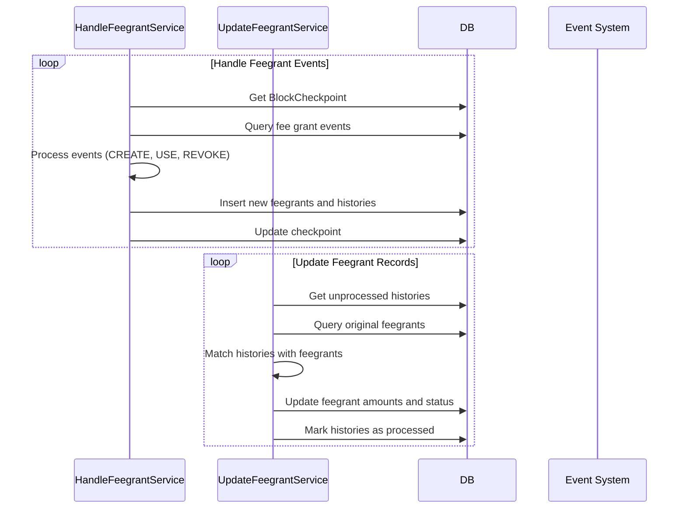

# Fee Grant Service

## Overview
The Fee Grant Service is responsible for processing and indexing fee grant transactions in the Cosmos blockchain. It handles the creation, usage, and revocation of fee grants, which allow one account (granter) to pay transaction fees on behalf of another account (grantee).

## Services

### 1. Handle Feegrant History Service (`feegrant.service.ts`)
Processes fee grant events from blockchain transactions and creates initial records.

### 2. Update Feegrant Service (`update_feegrant.service.ts`)
Updates fee grant records based on usage, revocation, and expiration events.

## Features

### Fee Grant Actions
- **CREATE**: Creates a new fee grant
- **USE**: Uses fee grant for transaction fees
- **REVOKE**: Revokes an existing fee grant
- **USE_UP**: Indicates fee grant has been fully consumed

### Allowance Types
- **BasicAllowance**: Simple fee grant with spend limit and expiration
- **PeriodicAllowance**: Fee grant with periodic spending limits
- **AllowedMsgAllowance**: Fee grant restricted to specific message types
- **AllowedContractAllowance**: Fee grant restricted to specific contracts

### Fee Grant Status
- **Available**: Fee grant is active and can be used
- **Use up**: Fee grant has been fully consumed
- **Revoked**: Fee grant has been revoked
- **Fail**: Fee grant processing failed

## Architecture

### Service Flow



### Database Schema

#### Feegrant Table
- `id`: Primary key
- `init_tx_id`: Transaction ID that created the fee grant
- `granter`: Address of the fee grant granter
- `grantee`: Address of the fee grant grantee
- `type`: Type of allowance (BasicAllowance, PeriodicAllowance, etc.)
- `spend_limit`: Maximum amount that can be spent
- `denom`: Token denomination
- `expiration`: Expiration date of the fee grant
- `status`: Current status (Available, Use up, Revoked, Fail)
- `revoke_tx_id`: Transaction ID that revoked the fee grant

#### FeegrantHistory Table
- `id`: Primary key
- `tx_id`: Transaction ID
- `action`: Action type (CREATE, USE, REVOKE, USE_UP)
- `granter`: Granter address
- `grantee`: Grantee address
- `amount`: Amount used or granted
- `denom`: Token denomination
- `feegrant_id`: Reference to the original fee grant
- `processed`: Whether the history has been processed

## Configuration

The service behavior can be configured through `config.json`:

```json
{
  "feegrant": {
    "key": "handle_feegrant",
    "millisecondRepeatJob": <interval_in_ms>,
    "updateFeegrant": {
      "limitPerCall": <number_of_records>,
      "millisecondRepeatJob": <interval_in_ms>
    }
  }
}
```

## Event Types

The service processes the following blockchain events:
- `set_feegrant`: Fee grant creation
- `use_feegrant`: Fee grant usage
- `revoke_feegrant`: Fee grant revocation

## Processing Logic

### Handle Feegrant Service
1. Gets block range from checkpoint system
2. Queries fee grant events from the specified block range
3. Processes each event type:
   - **SET_FEEGRANT**: Creates new fee grant record and history
   - **USE_FEEGRANT**: Creates usage history record
   - **REVOKE_FEEGRANT**: Creates revocation history or marks as used up
4. Updates block checkpoint

### Update Feegrant Service
1. Retrieves unprocessed fee grant histories
2. Matches histories with original fee grants
3. Calculates updated amounts and status:
   - **USE**: Reduces spendable amount
   - **REVOKE**: Changes status to revoked
   - **USE_UP**: Changes status to used up
4. Updates fee grant records in batch
5. Marks histories as processed

## Dependencies
- Requires `HandleTransaction` service to be running
- Uses Bull queue for job processing
- Depends on block checkpoint system for progress tracking
- Integrates with event and transaction processing systems

## Error Handling
- Failed jobs are retried up to 3 times
- Job records are removed upon successful completion
- Failed job records are kept for debugging purposes
- Transaction rollback on processing errors

## Monitoring
The service provides logging at different levels:
- INFO: Block range processing and batch updates
- DEBUG: Detailed processing results
- ERROR: Processing failures and validation errors

## Performance Considerations
- Uses database transactions for atomic operations
- Processes events in batches by block ranges
- Maintains synchronization with transaction processing
- Implements efficient batch updates for fee grant records
- Uses BigInt for precise amount calculations

## Security Features
- Validates fee grant types and structures
- Ensures proper granter-grantee relationships
- Prevents double-spending through status tracking
- Maintains audit trail through history records 