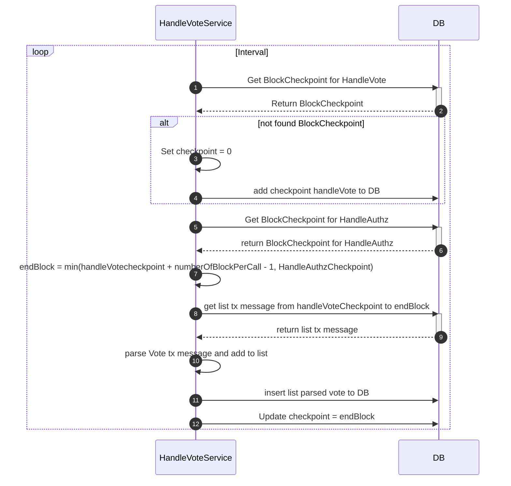

# Handle Vote Service

## Overview
The Handle Vote Service is responsible for processing and indexing governance vote transactions in the Cosmos blockchain. It continuously monitors new blocks for vote-related transactions, processes them, and stores the voting data in the database.

## Features
- Processes `MsgVote` and `MsgVoteV1` transaction types
- Handles vote updates (overwrites previous votes from the same voter on the same proposal)
- Maintains block checkpoints to ensure reliable processing
- Supports transaction batching for efficient database operations
- Integrates with the authorization transaction system

## Architecture

### Service Flow
The service follows this sequence of operations:



### Database Schema
The service interacts with the following database tables:
- `vote`: Stores voting records
  - `voter`: Address of the voter
  - `proposal_id`: ID of the proposal being voted on
  - `vote_option`: The vote choice
  - `height`: Block height of the vote
  - `txhash`: Transaction hash
  - `tx_id`: Internal transaction ID

## Configuration
The service behavior can be configured through `config.json`:

```json
{
  "handleVoteTx": {
    "key": "handle_vote_tx",
    "millisecondCrawl": <interval_in_ms>
  }
}
```

## Dependencies
- Requires `HandleAuthzTx` service to be running
- Uses Bull queue for job processing
- Depends on block checkpoint system for progress tracking

## Error Handling
- Failed jobs are retried up to 3 times
- Job records are removed upon successful completion
- Failed job records are kept for debugging purposes

## Monitoring
The service provides logging at different levels:
- INFO: Block range processing information
- DEBUG: Detailed vote insertion results

## Performance Considerations
- Uses database transactions for atomic operations
- Processes votes in batches by block ranges
- Maintains synchronization with authorization transaction processing 