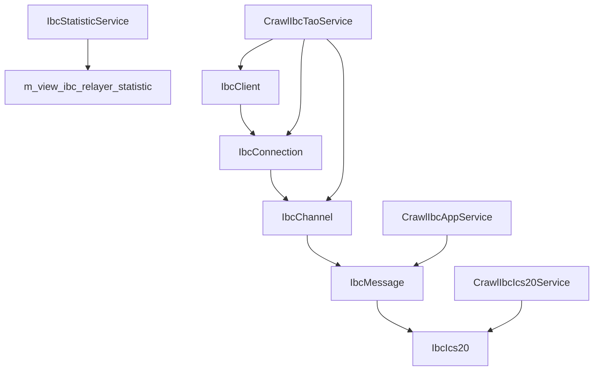
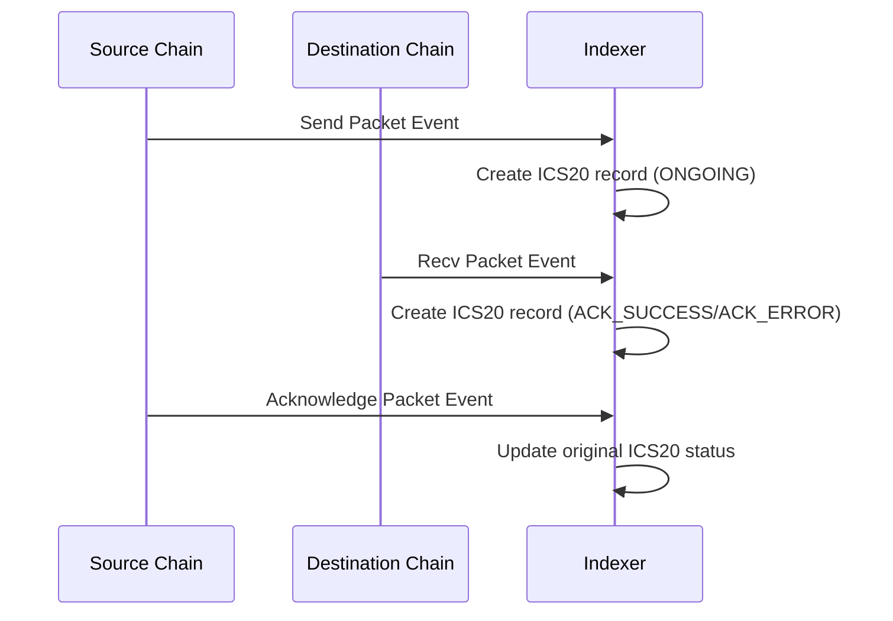

# IBC Services

Dịch vụ crawl và xử lý dữ liệu Inter-Blockchain Communication (IBC) trong hệ thống indexer Cosmos modules.

## Tổng quan

Hệ thống IBC services bao gồm 4 service chính để crawl và xử lý dữ liệu IBC:

1. **CrawlIbcTaoService** - Crawl dữ liệu TAO (Transport, Authentication, Ordering)
2. **CrawlIbcAppService** - Crawl dữ liệu ứng dụng IBC
3. **CrawlIbcIcs20Service** - Crawl dữ liệu token transfer ICS-20
4. **IbcStatisticService** - Cập nhật thống kê IBC

## Kiến trúc tổng thể



## Các Service

### 1. CrawlIbcTaoService

Service crawl dữ liệu TAO (Transport, Authentication, Ordering) - các thành phần cơ bản của IBC.

**Chức năng:**
- Tạo và quản lý IBC clients
- Tạo và quản lý IBC connections  
- Tạo và quản lý IBC channels
- Cập nhật trạng thái channel (open/close)

**Events được xử lý:**
- `create_client` - Tạo client mới
- `connection_open_ack` - Xác nhận mở connection
- `connection_open_confirm` - Xác nhận mở connection
- `channel_open_ack` - Xác nhận mở channel
- `channel_open_confirm` - Xác nhận mở channel
- `channel_close_init` - Bắt đầu đóng channel
- `channel_close_confirm` - Xác nhận đóng channel
- `channel_close` - Đóng channel

**Dữ liệu được lưu:**
- `ibc_client` - Thông tin client IBC
- `ibc_connection` - Thông tin connection IBC
- `ibc_channel` - Thông tin channel IBC

### 2. CrawlIbcAppService

Service crawl dữ liệu ứng dụng IBC - các message và packet được gửi qua IBC.

**Chức năng:**
- Crawl các IBC message events
- Xử lý các packet events (send, receive, acknowledge, timeout)
- Lưu trữ dữ liệu message vào database

**Events được xử lý:**
- `send_packet` - Gửi packet
- `recv_packet` - Nhận packet
- `acknowledge_packet` - Xác nhận packet
- `timeout_packet` - Timeout packet

**Dữ liệu được lưu:**
- `ibc_message` - Thông tin message IBC

### 3. CrawlIbcIcs20Service

Service crawl dữ liệu token transfer theo chuẩn ICS-20 (Interchain Standard 20).

**Chức năng:**
- Xử lý token transfer giữa các chain
- Theo dõi trạng thái transfer (ongoing, success, error, timeout)
- Cập nhật trạng thái transfer dựa trên acknowledgment

**Quy trình xử lý:**



**Trạng thái transfer:**
- `ONGOING` - Transfer đang diễn ra
- `ACK_SUCCESS` - Transfer thành công
- `ACK_ERROR` - Transfer thất bại
- `TIMEOUT` - Transfer timeout

**Dữ liệu được lưu:**
- `ibc_ics20` - Thông tin token transfer ICS-20

### 4. IbcStatisticService

Service cập nhật thống kê IBC relayer.

**Chức năng:**
- Refresh materialized view `m_view_ibc_relayer_statistic`
- Cung cấp thống kê về hoạt động của IBC relayers

## Cấu trúc Database

### Bảng chính

#### ibc_client
- `id` - Primary key
- `client_id` - ID của client IBC
- `counterparty_chain_id` - Chain ID của counterparty
- `client_state` - Trạng thái client (JSONB)
- `consensus_state` - Trạng thái consensus (JSONB)
- `client_type` - Loại client

#### ibc_connection
- `id` - Primary key
- `ibc_client_id` - Foreign key đến ibc_client
- `connection_id` - ID của connection
- `counterparty_client_id` - Client ID của counterparty
- `counterparty_connection_id` - Connection ID của counterparty

#### ibc_channel
- `id` - Primary key
- `ibc_connection_id` - Foreign key đến ibc_connection
- `channel_id` - ID của channel
- `port_id` - ID của port
- `counterparty_port_id` - Port ID của counterparty
- `counterparty_channel_id` - Channel ID của counterparty
- `state` - Trạng thái channel (OPEN/CLOSE)

#### ibc_message
- `id` - Primary key
- `transaction_message_id` - Foreign key đến transaction_message
- `src_channel_id` - Source channel ID
- `src_port_id` - Source port ID
- `dst_channel_id` - Destination channel ID
- `dst_port_id` - Destination port ID
- `type` - Loại message (send_packet, recv_packet, etc.)
- `sequence` - Sequence number
- `sequence_key` - Unique key cho sequence
- `data` - Dữ liệu message (JSONB)
- `tx_hash` - Hash của transaction

#### ibc_ics20
- `id` - Primary key
- `ibc_message_id` - Foreign key đến ibc_message
- `sender` - Địa chỉ người gửi
- `receiver` - Địa chỉ người nhận
- `amount` - Số lượng token
- `denom` - Denomination của token
- `status` - Trạng thái transfer
- `channel_id` - ID của channel
- `sequence_key` - Unique key cho sequence
- `type` - Loại transfer
- `memo` - Ghi chú
- `start_time` - Thời gian bắt đầu
- `finish_time` - Thời gian kết thúc

## Cấu hình

### Config cho các service

```json
{
  "crawlIbcTao": {
    "key": "crawl_ibc_tao",
    "millisecondRepeatJob": 5000
  },
  "crawlIbcApp": {
    "key": "crawl_ibc_app", 
    "millisecondRepeatJob": 5000
  },
  "crawlIbcIcs20": {
    "key": "crawl_ibc_ics20",
    "port": "transfer",
    "millisecondRepeatJob": 5000
  },
  "ibcStatistic": {
    "timeRefreshIbcRelayerStats": "0 */5 * * * *"
  }
}
```

## Job Queue

Các job được xử lý theo thứ tự:

1. `CRAWL_IBC_TAO` - Crawl dữ liệu TAO
2. `CRAWL_IBC_APP` - Crawl dữ liệu ứng dụng (sau TAO)
3. `CRAWL_IBC_ICS20` - Crawl dữ liệu ICS-20 (sau APP)
4. `REFRESH_IBC_RELAYER_STATISTIC` - Refresh thống kê (độc lập)

## API Endpoints

Các service này cung cấp dữ liệu cho các API endpoints thông qua Hasura GraphQL:

- Query IBC clients, connections, channels
- Query IBC messages và transfers
- Query thống kê IBC relayer
- Filter và search theo các tiêu chí khác nhau

## Monitoring

- Logs được ghi cho mỗi service
- Block checkpoint được sử dụng để đảm bảo không bỏ sót dữ liệu
- Error handling cho các trường hợp lỗi
- Retry mechanism cho các job thất bại

## Dependencies

- Moleculer framework
- Bull queue system
- Knex.js cho database operations
- Objection.js cho ORM
- Hasura cho GraphQL API 